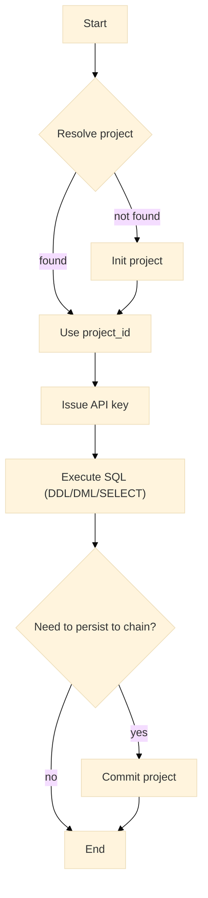

# Warlot Go SDK — Overview

The Warlot Go SDK provides a typed, production-grade interface to the Warlot SQL Database API. The SDK encapsulates authentication headers, resilient HTTP transport with retries, and higher-level helpers for projects, SQL execution, streaming result sets, pagination, and schema migrations.

---

## Scope

* **API coverage:** project lifecycle (resolve/init), API key issuance, SQL (DDL/DML/SELECT), table browsing and schema, project status and commit.
* **Ergonomics:** `Client` for shared configuration; `Project` handle for per-project operations; typed `Query[T]` mapping; `RowScanner` streaming; `Pager` pagination; `Migrator` for file-based migrations.
* **Reliability:** retry with jitter for 429/5xx, optional `Retry-After` handling, idempotency key support for writes.
* **Observability:** pluggable structured logging with header redaction; request/response hooks.

---

## Supported platforms

| Component    | Versions / Notes                                  |
| ------------ | ------------------------------------------------- |
| Go toolchain | Go 1.18+ (generic functions); tested on 1.20–1.22 |
| OS           | Linux, macOS, Windows (including WSL)             |
| Transport    | HTTPS (HTTP/2 supported by default client)        |

---

## Primary capabilities

* **Project lifecycle:** resolve existing projects or initialize new ones; normalize legacy/modern response shapes.
* **Authentication:** multi-header scheme (`x-api-key`, `x-holder-id`, `x-project-name`); key issuance endpoint.
* **SQL execution:** parameterized queries; dual-shape responses for DDL/DML and SELECT; typed row mapping.
* **Large results:** JSON streaming via `RowScanner`; offset-based pagination via `Pager`.
* **Migrations:** idempotent application of ordered `.sql` files with a `_migrations` ledger table.
* **Resilience:** configurable retries, timeouts, and backoff; idempotency keys for writes.
* **CLI:** `warlotctl` command for resolving/initializing projects, issuing keys, executing SQL, inspecting tables, and committing.

---

## Architecture at a glance

* **Client:** shared configuration and HTTP plumbing. Emits standard auth headers when configured.
* **Project:** thin wrapper around `Client` for a specific project ID; methods mirror top-level operations.
* **Typed query helper:** `Query[T]` maps SELECT rows into strongly-typed slices using JSON tags.
* **Streaming & pagination:** `ExecSQLStream` returns `RowScanner`; `Pager` iterates table rows in batches.
* **Migrations:** `Migrator.Up` applies ordered `.sql` files and records applied entries.

---

## Lifecycle flow

---

## Document map

| Topic                           | File                         |
| ------------------------------- | ---------------------------- |
| Installation & prerequisites    | `01-installation.md`         |
| Quickstart (end-to-end)         | `02-quickstart.md`           |
| Authentication & headers        | `03-authentication.md`       |
| Client configuration & options  | `04-configuration.md`        |
| Projects API                    | `05-projects.md`             |
| SQL, typed queries, idempotency | `06-sql.md`                  |
| Streaming & pagination          | `07-streaming-pagination.md` |
| Migrations                      | `08-migrations.md`           |
| Error model                     | `09-errors.md`               |
| Retries & rate limits           | `10-retries-rate-limits.md`  |
| CLI reference                   | `11-cli.md`                  |
| Public type definitions         | `12-types.md`                |
| Testing definitions & layout    | `13-testing.md`              |
| Troubleshooting                 | `14-troubleshooting.md`      |
| Security guidance               | `15-security.md`             |
| Versioning & changelog          | `16-versioning-changelog.md` |
| FAQ                             | `17-faq.md`                  |
| Glossary                        | `18-glossary.md`             |
| Support                         | `19-support.md`              |

---

## Core types (index)

> Full definitions appear in `12-types.md`. This section lists primary entry points.

* `type Client struct { … }` — base API client, headers, retries, logging, hooks.
* `type Project struct { ID string; Client *Client }` — per-project operations.
* `type Migrator struct{}` — schema migration runner.
* `type RowScanner struct { … }` — streaming row reader for SELECT responses.
* `type Pager struct { … }` — offset-based table pagination helper.

**Requests/Responses**

* `InitProjectRequest`, `InitProjectResponse`
* `IssueKeyRequest`, `IssueKeyResponse`
* `ResolveProjectRequest`, `ResolveProjectResponse`
* `SQLRequest`, `SQLResponse`
* `ListTablesResponse`, `BrowseRowsResponse`, `TableSchema`
* `ProjectStatus`, `CommitResponse`
* `TableCountResponse`

**Errors**

* `type APIError struct { StatusCode int; Body string; Message string; Code string; Details any }`

**Options**

* `type Option func(*Client)` — construction-time configuration.
* `type CallOption func(*callOptions)` — per-request customization (e.g., idempotency).

---

## Testing modes (definition)

| Mode       | Location             | Characteristics                                                        | Triggers                       |
| ---------- | -------------------- | ---------------------------------------------------------------------- | ------------------------------ |
| Unit tests | `./warlot/*_test.go` | Fast, offline, stubbed HTTP; golden fixtures under `warlot/testdata/`. | `go test ./warlot`             |
| Live E2E   | `./e2e/e2e_test.go`  | Hits hosted API; longer timeouts; logs enabled.                        | `WARLOT_E2E=1 … go test ./e2e` |

Environment variables for E2E are defined in `13-testing.md`.

---

## Versioning

* Semantic Versioning is applied to the public API surface.
* Backward-compatible enhancements increment the minor version.
* Breaking changes increment the major version and are documented in `16-versioning-changelog.md`.

---

## Security notes (summary)

* API keys transmitted via `x-api-key`; redaction applied in SDK logs.
* Idempotency keys recommended for write operations to avoid duplicate effects during retries.
* Additional guidance appears in `15-security.md`.

---

## Support

Support and reporting channels are listed in `19-support.md`.
