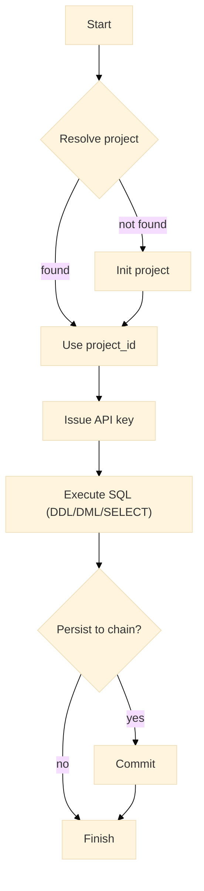

# Quickstart

End-to-end walk-through for creating a project (or resolving an existing one), issuing an API key, running basic SQL (DDL/DML/SELECT), and optionally committing to chain.

---

## Objective

* Construct a `Client`.
* Resolve or initialize a project.
* Issue an API key.
* Execute SQL operations.
* Optionally commit project changes.

---

## Prerequisites

| Item              | Notes                                                         |
| ----------------- | ------------------------------------------------------------- |
| Go toolchain      | Go 1.18+                                                      |
| Holder identifier | Hex address string                                            |
| Owner address     | Hex address string                                            |
| Project name      | Human-readable string                                         |
| Network egress    | HTTPS to API base (default `https://warlot-api.onrender.com`) |

---

## Lifecycle at a glance



---

## Step 1 — Construct a client

```go
package main

import (
	"context"
	"fmt"
	"net/http"
	"time"

	"github.com/steven3002/warlot-golang-sdk/warlot-go/warlot"
)

func newClient(holder, projectName string) *warlot.Client {
	return warlot.New(
		warlot.WithHolderID(holder),
		warlot.WithProjectName(projectName),
		warlot.WithHTTPClient(&http.Client{Timeout: 90 * time.Second}),
		warlot.WithRetries(6),
		warlot.WithBackoff(1*time.Second, 8*time.Second),
	)
}
```

---

## Step 2 — Resolve or initialize the project

```go
func resolveOrInit(ctx context.Context, cl *warlot.Client, holder, projectName, owner string) (string, error) {
	// Resolve by holder + project name
	res, err := cl.ResolveProject(ctx, warlot.ResolveProjectRequest{
		HolderID: holder, ProjectName: projectName,
	})
	if err == nil && res.ProjectID != "" {
		return res.ProjectID, nil
	}

	// Initialize a new project
	initRes, err := cl.InitProject(ctx, warlot.InitProjectRequest{
		HolderID: holder, ProjectName: projectName, OwnerAddress: owner,
		IncludePass: true, Deletable: true,
	})
	if err != nil {
		return "", fmt.Errorf("init failed: %w", err)
	}
	return initRes.ProjectID, nil
}
```

---

## Step 3 — Issue an API key

```go
func issueKey(ctx context.Context, cl *warlot.Client, holder, projectName, projectID, owner string) (string, error) {
	key, err := cl.IssueAPIKey(ctx, warlot.IssueKeyRequest{
		ProjectID: projectID, ProjectHolder: holder, ProjectName: projectName, User: owner,
	})
	if err != nil {
		return "", err
	}
	return key.APIKey, nil
}
```

Attach the key to the client once issued:

```go
cl.APIKey = apiKey
```

---

## Step 4 — Execute SQL (DDL/DML/SELECT)

```go
func basicSQL(ctx context.Context, cl *warlot.Client, projectID string) error {
	proj := cl.Project(projectID)

	// DDL: create a table if absent
	if _, err := proj.SQL(ctx, `
		CREATE TABLE IF NOT EXISTS products (
		  id INTEGER PRIMARY KEY AUTOINCREMENT,
		  name TEXT,
		  price REAL
		)`, nil); err != nil {
		return err
	}

	// DML: insert a row with parameters (idempotency for safety)
	if _, err := proj.SQL(ctx,
		`INSERT INTO products (name, price) VALUES (?, ?)`,
		[]any{"Laptop", 999.99},
		warlot.WithIdempotencyKey("quickstart-insert-1"),
	); err != nil {
		return err
	}

	// SELECT: fetch rows
	rs, err := proj.SQL(ctx, `SELECT id, name, price FROM products ORDER BY id DESC LIMIT 5`, nil)
	if err != nil {
		return err
	}
	for _, row := range rs.Rows {
		fmt.Printf("row=%v\n", row)
	}
	return nil
}
```

### Typed SELECT (optional)

```go
type Product struct {
	ID    int     `json:"id"`
	Name  string  `json:"name"`
	Price float64 `json:"price"`
}

func selectTyped(ctx context.Context, cl *warlot.Client, projectID string) error {
	proj := cl.Project(projectID)
	out, err := warlot.Query[Product](ctx, proj, `SELECT id, name, price FROM products ORDER BY id`, nil)
	if err != nil {
		return err
	}
	for _, p := range out {
		fmt.Printf("typed=%+v\n", p)
	}
	return nil
}
```

---

## Step 5 — Commit (optional)

```go
func commit(ctx context.Context, cl *warlot.Client, projectID string) error {
	_, err := cl.CommitProject(ctx, projectID)
	return err
}
```

---

## Full example (main function)

```go
func main() {
	ctx := context.Background()

	const (
		holder      = "0xHOLDER..."
		projectName = "quickstart_project"
		owner       = "0xOWNER..."
	)

	cl := newClient(holder, projectName)

	projectID, err := resolveOrInit(ctx, cl, holder, projectName, owner)
	if err != nil {
		panic(err)
	}

	apiKey, err := issueKey(ctx, cl, holder, projectName, projectID, owner)
	if err != nil {
		panic(err)
	}
	cl.APIKey = apiKey

	if err := basicSQL(ctx, cl, projectID); err != nil {
		panic(err)
	}

	// Optional: commit to chain
	// _ = commit(ctx, cl, projectID)
}
```

---

## Error handling (definition)

`APIError` exposes structured fields for non-success responses:

```go
type APIError struct {
	StatusCode int
	Body       string
	Message    string
	Code       string
	Details    any
}
```

Example of detecting a rate-limit or server error:

```go
if err != nil {
	if e, ok := err.(*warlot.APIError); ok {
		switch {
		case e.StatusCode == 429:
			// Rate-limited; consider retry/backoff.
		case e.StatusCode >= 500:
			// Transient server error.
		default:
			// Client or authorization error.
		}
	}
}
```

---

## Types referenced in this quickstart

```go
// Construction
func New(opts ...Option) *Client
type Option func(*Client)
func WithHolderID(string) Option
func WithProjectName(string) Option
func WithAPIKey(string) Option
func WithHTTPClient(*http.Client) Option
func WithRetries(int) Option
func WithBackoff(initial, max time.Duration) Option

// Project handle
type Project struct {
	ID     string
	Client *Client
}
func (c *Client) Project(id string) Project
func (p Project) SQL(ctx context.Context, sql string, params []any, opts ...CallOption) (*SQLResponse, error)

// Calls and responses
type SQLRequest struct {
	SQL    string        `json:"sql"`
	Params []interface{} `json:"params"`
}
type SQLResponse struct {
	OK       bool                     `json:"ok"`
	RowCount *int                     `json:"row_count,omitempty"`
	Rows     []map[string]interface{} `json:"rows,omitempty"`
	Error    string                   `json:"error,omitempty"`
}
type InitProjectRequest struct{ /* …fields… */ }
type InitProjectResponse struct{ /* …fields… */ }
type IssueKeyRequest struct{ /* …fields… */ }
type IssueKeyResponse struct{ /* …fields… */ }
type ResolveProjectRequest struct{ /* …fields… */ }
type ResolveProjectResponse struct{ /* …fields… */ }

// Per-call options
type CallOption func(*callOptions)
func WithIdempotencyKey(string) CallOption

// Helpers
func Query[T any](ctx context.Context, p Project, sql string, params []any, opts ...CallOption) ([]T, error)

// Errors
type APIError struct{ /* …fields… */ }
```

---

## Test definition (quickstart validation)

A minimal live validation test (skips unless explicitly enabled):

```go
// quickstart_e2e_test.go
package quickstart

import (
	"context"
	"net/http"
	"os"
	"testing"
	"time"

	"github.com/steven3002/warlot-golang-sdk/warlot-go/warlot"
)

func Test_Quickstart_Live(t *testing.T) {
	if os.Getenv("WARLOT_E2E") != "1" {
		t.Skip("enable with WARLOT_E2E=1")
	}
	holder := mustEnv(t, "WARLOT_HOLDER")
	owner := mustEnv(t, "WARLOT_OWNER")
	pname := mustEnv(t, "WARLOT_PNAME")

	cl := warlot.New(
		warlot.WithHolderID(holder),
		warlot.WithProjectName(pname),
		warlot.WithHTTPClient(&http.Client{Timeout: 90 * time.Second}),
		warlot.WithRetries(6),
	)

	ctx := context.Background()
	res, _ := cl.ResolveProject(ctx, warlot.ResolveProjectRequest{HolderID: holder, ProjectName: pname})
	projectID := res.ProjectID
	if projectID == "" {
		initRes, err := cl.InitProject(ctx, warlot.InitProjectRequest{
			HolderID: holder, ProjectName: pname, OwnerAddress: owner,
			IncludePass: true, Deletable: true,
		})
		if err != nil {
			t.Fatalf("init: %v", err)
		}
		projectID = initRes.ProjectID
	}

	iss, err := cl.IssueAPIKey(ctx, warlot.IssueKeyRequest{
		ProjectID: projectID, ProjectHolder: holder, ProjectName: pname, User: owner,
	})
	if err != nil {
		t.Fatalf("issue key: %v", err)
	}
	cl.APIKey = iss.APIKey

	proj := cl.Project(projectID)
	if _, err := proj.SQL(ctx, `CREATE TABLE IF NOT EXISTS products (id INTEGER PRIMARY KEY AUTOINCREMENT, name TEXT, price REAL)`, nil); err != nil {
		t.Fatalf("create: %v", err)
	}
	if _, err := proj.SQL(ctx, `INSERT INTO products (name, price) VALUES (?, ?)`, []any{"X", 1.23}, warlot.WithIdempotencyKey("qs-insert-1")); err != nil {
		t.Fatalf("insert: %v", err)
	}
	if _, err := proj.SQL(ctx, `SELECT * FROM products LIMIT 1`, nil); err != nil {
		t.Fatalf("select: %v", err)
	}
}

func mustEnv(t *testing.T, k string) string {
	t.Helper()
	v := os.Getenv(k)
	if v == "" {
		t.Fatalf("missing %s", k)
	}
	return v
}
```

Execution:

```bash
export WARLOT_E2E=1
export WARLOT_HOLDER=0x...
export WARLOT_OWNER=0x...
export WARLOT_PNAME=quickstart_project
go test ./e2e -v -run Quickstart
```

---

## Next steps

* Authentication header details: `03-authentication.md`
* Configuration matrix and defaults: `04-configuration.md`
* SQL and typed query patterns: `06-sql.md`
* Streaming and pagination: `07-streaming-pagination.md`
