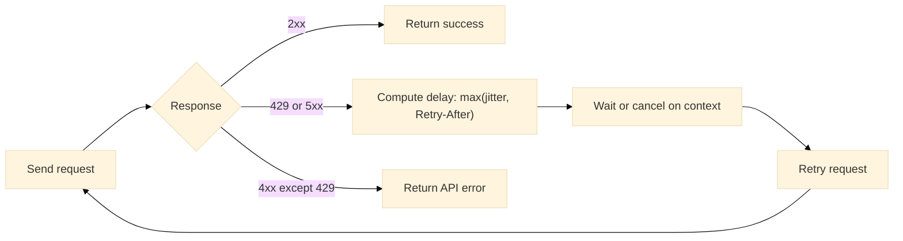

# Configuration

This page describes construction of the SDK client, supported options, environment-driven defaults, request-level overrides, logging and hooks, and retry/backoff behavior.

---

## Overview

* `Client` encapsulates base URL, authentication headers, HTTP transport, timeouts, retries, user agent, and observability hooks.
* Configuration occurs at two levels:

  1. **Construction-time** via `Option` functions.
  2. **Per-call** via `CallOption` functions (for example, idempotency keys).

---

## Construction

```go
import (
	"net/http"
	"time"

	"github.com/steven3002/warlot-golang-sdk/warlot-go/warlot"
)

func newClient() *warlot.Client {
	return warlot.New(
		warlot.WithBaseURL("https://warlot-api.onrender.com"),
		warlot.WithHolderID("0xHOLDER..."),
		warlot.WithProjectName("project_name"),
		warlot.WithHTTPClient(&http.Client{Timeout: 90 * time.Second}),
		warlot.WithUserAgent("example-app/1.0"),
		warlot.WithRetries(6),
		warlot.WithBackoff(1*time.Second, 8*time.Second),
		warlot.WithLogger(func(event string, meta map[string]any) {
			// meta headers contain redacted x-api-key
		}),
	)
}
```

---

## Options matrix

| Option                                   | Purpose                                                  | Default                                    |
| ---------------------------------------- | -------------------------------------------------------- | ------------------------------------------ |
| `WithBaseURL(string)`                    | Sets API base URL. Trailing slash is trimmed.            | `https://warlot-api.onrender.com`          |
| `WithAPIKey(string)`                     | Sets default `x-api-key` header for authenticated calls. | empty                                      |
| `WithHolderID(string)`                   | Sets default `x-holder-id` header.                       | empty                                      |
| `WithProjectName(string)`                | Sets default `x-project-name` header.                    | empty                                      |
| `WithHTTPClient(*http.Client)`           | Replaces the internal HTTP client.                       | Tuned `http.Client` (timeouts, keep-alive) |
| `WithUserAgent(string)`                  | Sets custom User-Agent.                                  | `warlot-go/…`                              |
| `WithRetries(int)`                       | Sets maximum retries for `429` and `5xx`.                | `3`                                        |
| `WithBackoff(initial,max time.Duration)` | Configures jittered exponential backoff.                 | `initial=300ms`, `max=3s`                  |
| `WithLogger(Logger)`                     | Enables structured logs with header redaction.           | nil                                        |

Construction-time API:

```go
type Option func(*Client)

type Logger func(event string, metadata map[string]any)
```

---

## Environment variable defaults (optional)

| Variable                 | Effect                       | Example                           |
| ------------------------ | ---------------------------- | --------------------------------- |
| `WARLOT_BASE_URL`        | Base URL override            | `https://warlot-api.onrender.com` |
| `WARLOT_API_KEY`         | Default API key              | `a2f5…37e0`                       |
| `WARLOT_HOLDER`          | Default holder               | `0x2e4a…7ba3`                     |
| `WARLOT_PNAME`           | Default project name         | `my_project`                      |
| `WARLOT_TIMEOUT`         | Request timeout (seconds)    | `90`                              |
| `WARLOT_RETRIES`         | Max retries on `429/5xx`     | `6`                               |
| `WARLOT_BACKOFF_INIT_MS` | Initial backoff milliseconds | `1000`                            |
| `WARLOT_BACKOFF_MAX_MS`  | Max backoff milliseconds     | `8000`                            |

---

## Authentication headers

`Client` automatically forwards configured headers to all relevant endpoints.

* `x-api-key` from `Client.APIKey`
* `x-holder-id` from `Client.HolderID`
* `x-project-name` from `Client.ProjectName`

A project can be targeted via:

```go
proj := client.Project(projectID) // returns warlot.Project
// proj.SQL / proj.Tables / proj.Schema / proj.Count / proj.Status / proj.Commit
```

---

## Per-call options

`CallOption` enables request-scoped customization.

```go
type CallOption func(*callOptions)

func WithIdempotencyKey(k string) CallOption
func WithHeader(key, value string) CallOption
func WithLabel(l string) CallOption
```

**Idempotency recommendation:** Write operations (INSERT/UPDATE/DELETE/DDL) should include a stable idempotency key when retry is enabled, for example:

```go
_, err := proj.SQL(ctx, `INSERT INTO products(name,price) VALUES(?,?)`,
	[]any{"Laptop", 999.99},
	warlot.WithIdempotencyKey("insert-products-2025-10-03-001"),
)
```

---

## Retries and backoff

* Retries are performed for `429` (rate limit) and `5xx` (server) responses.
* `Retry-After` header, when present, influences the next delay.
* Backoff grows exponentially with jitter and is capped by the configured maximum.

### Retry state (flow)



Tuning example:

```go
client := warlot.New(
	warlot.WithRetries(6),
	warlot.WithBackoff(1*time.Second, 16*time.Second),
)
```

---

## Timeouts and transport

* Default client enables connection pooling and sane timeouts:

  * Dial: 10s
  * TLS handshake: 10s
  * Response header: 30s
  * Idle connection timeout: 90s
* Custom transports are supported:

```go
tr := &http.Transport{
	Proxy: http.ProxyFromEnvironment,
	// Custom proxies or dialers can be provided here
}
client := warlot.New(
	warlot.WithHTTPClient(&http.Client{
		Timeout:   120 * time.Second, // overall per-request timeout
		Transport: tr,
	}),
)
```

---

## Logging and hooks

Structured logging:

```go
client := warlot.New(
	warlot.WithLogger(func(event string, meta map[string]any) {
		// meta contains: method, url, attempt, status (on response), headers (redacted)
	}),
)
```

* Headers reported via logs redact `x-api-key` values.
* Hooks enable pre/post instrumentation:

```go
client.BeforeHooks = append(client.BeforeHooks, func(r *http.Request) {
	// example: tracing headers
	r.Header.Set("x-trace-id", "trace-123")
})
client.AfterHooks = append(client.AfterHooks, func(res *http.Response, body []byte, err error) {
	// example: metrics or custom error reporting
})
```

---

## Complete configuration example

```go
client := warlot.New(
	warlot.WithBaseURL("https://warlot-api.onrender.com"),
	warlot.WithHolderID("0xHOLDER..."),
	warlot.WithProjectName("catalog"),
	warlot.WithUserAgent("catalog-svc/2.3"),
	warlot.WithRetries(5),
	warlot.WithBackoff(500*time.Millisecond, 6*time.Second),
	warlot.WithHTTPClient(&http.Client{Timeout: 75 * time.Second}),
	warlot.WithLogger(func(event string, meta map[string]any) { /* sink */ }),
)
client.APIKey = "a2f5…37e0"

proj := client.Project("3c58bfc5-64a9-45ff-9510-a6584ee96248")
_, _ = proj.SQL(ctx, `CREATE TABLE IF NOT EXISTS t(id INTEGER)`, nil, warlot.WithIdempotencyKey("ddl-1"))
```

---

## Types (definition)

```go
// Construction-time configuration
func New(opts ...Option) *Client
type Option func(*Client)

func WithBaseURL(u string) Option
func WithAPIKey(k string) Option
func WithHolderID(h string) Option
func WithProjectName(n string) Option
func WithHTTPClient(h *http.Client) Option
func WithUserAgent(ua string) Option
func WithRetries(max int) Option
func WithBackoff(initial, max time.Duration) Option
func WithLogger(l Logger) Option

// Core client
type Client struct {
	BaseURL        string
	APIKey         string
	HolderID       string
	ProjectName    string
	HTTPClient     *http.Client
	UserAgent      string
	MaxRetries     int
	InitialBackoff time.Duration
	MaxBackoff     time.Duration
	Logger         Logger
	BeforeHooks    []func(*http.Request)
	AfterHooks     []func(*http.Response, []byte, error)
}

// Request-scoped configuration
type CallOption func(*callOptions)
func WithIdempotencyKey(k string) CallOption
func WithHeader(key, value string) CallOption
func WithLabel(l string) CallOption

// Logger hook
type Logger func(event string, metadata map[string]any)
```

---

## Unit test definitions

### 1) Retry with `Retry-After`

```go
// configuration_retryafter_test.go (package warlot)
package warlot

import (
	"context"
	"net/http"
	"net/http/httptest"
	"sync/atomic"
	"testing"
	"time"
)

func Test_RetryHonorsRetryAfter(t *testing.T) {
	var calls int32
	s := httptest.NewServer(http.HandlerFunc(func(w http.ResponseWriter, r *http.Request) {
		c := atomic.AddInt32(&calls, 1)
		if c == 1 {
			w.Header().Set("Retry-After", "1")
			http.Error(w, `{"message":"rate limited"}`, http.StatusTooManyRequests)
			return
		}
		w.WriteHeader(200)
		w.Write([]byte(`{"ok":true,"row_count":0}`))
	}))
	defer s.Close()

	cl := New(WithBaseURL(s.URL), WithRetries(2), WithBackoff(100*time.Millisecond, 200*time.Millisecond))
	start := time.Now()
	_, err := cl.ExecSQL(context.Background(), "p", SQLRequest{SQL: "CREATE TABLE t(x)", Params: nil})
	if err != nil {
		t.Fatalf("ExecSQL failed: %v", err)
	}
	if time.Since(start) < 900*time.Millisecond {
		t.Fatalf("Retry did not honor Retry-After")
	}
}
```

### 2) Logger redacts API key

```go
// configuration_logger_redact_test.go (package warlot)
package warlot

import (
	"context"
	"net/http"
	"net/http/httptest"
	"strings"
	"testing"
)

func Test_Logger_RedactsAPIKey(t *testing.T) {
	s := httptest.NewServer(http.HandlerFunc(func(w http.ResponseWriter, r *http.Request) {
		w.WriteHeader(200)
		w.Write([]byte(`{"ok":true,"row_count":0}`))
	}))
	defer s.Close()

	var seen string
	cl := New(
		WithBaseURL(s.URL),
		WithAPIKey("secretkey"),
		WithLogger(func(event string, meta map[string]any) {
			if event == "request" {
				if h, ok := meta["headers"].(http.Header); ok {
					seen = h.Get("x-api-key")
				}
			}
		}),
	)
	_, err := cl.ExecSQL(context.Background(), "p", SQLRequest{SQL: "CREATE TABLE t(x)", Params: nil})
	if err != nil {
		t.Fatalf("ExecSQL failed: %v", err)
	}
	if strings.Contains(seen, "secretkey") || seen == "" {
		t.Fatalf("API key not redacted in logs: %q", seen)
	}
}
```

---

## Troubleshooting (configuration)

| Symptom                   | Likely cause                                | Action                                               |
| ------------------------- | ------------------------------------------- | ---------------------------------------------------- |
| Requests time out quickly | Low `http.Client.Timeout`                   | Increase timeout via `WithHTTPClient`                |
| Excessive retry delay     | Large `Retry-After` or large backoff maxima | Reduce backoff maxima or retries                     |
| `401/403`                 | Missing or mismatched auth headers          | Confirm `APIKey`, `HolderID`, `ProjectName` values   |
| Proxy/TLS failures        | Environment proxy or custom CA required     | Configure custom `http.Transport` with proxy/RootCAs |

---

## Related topics

* Authentication and key issuance: `03-authentication.md`
* SQL and typed mapping: `06-sql.md`
* Retries and rate limits detail: `10-retries-rate-limits.md`
