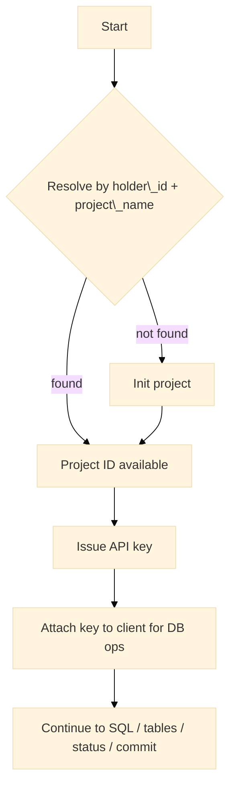

# Projects

Project lifecycle operations cover resolving an existing project, initializing a new project, and issuing an API key bound to that project. This page documents behavior, flow, method mapping, examples, and type/test definitions.

---

## Capabilities

* Resolve a project by `(holder_id, project_name)`.
* Initialize a project when resolution indicates absence.
* Issue an API key for authenticated database operations.
* Access ergonomic project-bound helpers via `Project` handle.
* Normalize legacy response fields to the current shape.

---

## Method ↔ Endpoint mapping

| Concern            | SDK method              | HTTP method & path                 | Headers (auto-applied by SDK)         |
| ------------------ | ----------------------- | ---------------------------------- | ------------------------------------- |
| Resolve project    | `Client.ResolveProject` | `POST /warlotSql/projects/resolve` | `Content-Type`, optional `User-Agent` |
| Initialize project | `Client.InitProject`    | `POST /warlotSql/projects/init`    | `Content-Type`, optional `User-Agent` |
| Issue API key      | `Client.IssueAPIKey`    | `POST /auth/issue`                 | `Content-Type`, optional `User-Agent` |

> Authentication headers (`x-api-key`, `x-holder-id`, `x-project-name`) are not required for `resolve` and `init`. After issuance, `x-api-key` is required for database operations (SQL, tables, status, commit).

---

## Lifecycle (resolve-or-init)



---

## Examples

### Resolve an existing project

```go
import (
	"context"
	"time"

	"github.com/steven3002/warlot-golang-sdk/warlot-go/warlot"
)

func resolve(ctx context.Context, holder, projectName string) (string, error) {
	cl := warlot.New(
		warlot.WithHolderID(holder),
		warlot.WithProjectName(projectName),
	)

	// Bound the call to avoid indefinite waits.
	cctx, cancel := context.WithTimeout(ctx, 90*time.Second)
	defer cancel()

	r, err := cl.ResolveProject(cctx, warlot.ResolveProjectRequest{
		HolderID: holder, ProjectName: projectName,
	})
	if err != nil {
		return "", err
	}
	return r.ProjectID, nil // may be empty if not found
}
```

### Initialize a new project

```go
func initProject(ctx context.Context, holder, projectName, owner string) (string, error) {
	cl := warlot.New()
	cctx, cancel := context.WithTimeout(ctx, 3*time.Minute)
	defer cancel()

	res, err := cl.InitProject(cctx, warlot.InitProjectRequest{
		HolderID: holder,
		ProjectName: projectName,
		OwnerAddress: owner,

		// Tunables are forwarded as provided; defaults shown here are typical.
		EpochSet:      0,
		CycleEnd:      0,
		WritersLen:    0,
		TrackBackLen:  0,
		DraftEpochDur: 0,
		IncludePass:   true,
		Deletable:     true,
	})
	if err != nil {
		return "", err
	}
	return res.ProjectID, nil
}
```

### Issue an API key

```go
func issueKey(ctx context.Context, base *warlot.Client, holder, projectName, projectID, owner string) (string, error) {
	cctx, cancel := context.WithTimeout(ctx, 2*time.Minute)
	defer cancel()

	iss, err := base.IssueAPIKey(cctx, warlot.IssueKeyRequest{
		ProjectID:     projectID,
		ProjectHolder: holder,
		ProjectName:   projectName,
		User:          owner,
	})
	if err != nil {
		return "", err
	}
	return iss.APIKey, nil
}
```

### Project handle for ergonomic calls

```go
func useProject(ctx context.Context, cl *warlot.Client, projectID, apiKey string) error {
	cl.APIKey = apiKey // enables authenticated operations
	p := cl.Project(projectID)

	// Example: quick DDL
	_, err := p.SQL(ctx, `CREATE TABLE IF NOT EXISTS products (id INTEGER PRIMARY KEY AUTOINCREMENT, name TEXT)`, nil)
	return err
}
```

---

## Legacy field normalization

The resolve endpoint can return lowercase snake_case fields, or legacy PascalCase fields. The SDK normalizes the legacy shape into the modern fields on `ResolveProjectResponse`.

* If `ProjectID` is empty but `LegacyProjectID` is present, `ProjectID` is populated from the legacy value.
* If `DBID` is empty but `LegacyDBID` is present, `DBID` is populated from the legacy value.

No additional action is required in application code.

---

## Types (definition)

```go
// ---- Requests / responses ----

type ResolveProjectRequest struct {
	HolderID    string `json:"holder_id"`
	ProjectName string `json:"project_name"`
}

// Supports both modern and legacy shapes. Legacy fields are normalized.
type ResolveProjectResponse struct {
	// Modern (observed shape)
	ExistsMeta  bool   `json:"exists_meta"`
	ExistsChain bool   `json:"exists_chain"`
	ProjectID   string `json:"project_id"`
	DBID        string `json:"db_id"`
	Action      string `json:"action"`
	// Legacy (PascalCase)
	LegacyProjectID string `json:"ProjectID,omitempty"`
	LegacyDBID      string `json:"DBID,omitempty"`
}

type InitProjectRequest struct {
	HolderID      string `json:"holder_id"`
	ProjectName   string `json:"project_name"`
	OwnerAddress  string `json:"owner_address"`
	EpochSet      int    `json:"epoch_set"`
	CycleEnd      int    `json:"cycle_end"`
	WritersLen    int    `json:"writers_len"`
	TrackBackLen  int    `json:"track_back_len"`
	DraftEpochDur int    `json:"draft_epoch_dur"`
	IncludePass   bool   `json:"include_pass"`
	Deletable     bool   `json:"deletable"`
}

type InitProjectResponse struct {
	ProjectID    string `json:"ProjectID"`
	DBID         string `json:"DBID"`
	WriterPassID string `json:"WriterPassID"`
	BlobID       string `json:"BlobID"`
	TxDigest     string `json:"TxDigest"`
	CSVHashHex   string `json:"CSVHashHex"`
	DigestHex    string `json:"DigestHex"`
	SignatureHex string `json:"SignatureHex"`
}

type IssueKeyRequest struct {
	ProjectID     string `json:"projectId"`
	ProjectHolder string `json:"projectHolder"`
	ProjectName   string `json:"projectName"`
	User          string `json:"user"`
}

type IssueKeyResponse struct {
	APIKey string `json:"apiKey"`
	URL    string `json:"url"`
}

// ---- Client helpers ----

// Project is a light-weight handle bound to a project ID.
type Project struct {
	ID     string
	Client *Client
}

func (c *Client) Project(id string) Project

// Thin wrappers around Client methods:
func (p Project) SQL(ctx context.Context, sql string, params []any, opts ...CallOption) (*SQLResponse, error)
func (p Project) Tables(ctx context.Context, opts ...CallOption) (*ListTablesResponse, error)
func (p Project) Browse(ctx context.Context, table string, limit, offset int, opts ...CallOption) (*BrowseRowsResponse, error)
func (p Project) Schema(ctx context.Context, table string, opts ...CallOption) (TableSchema, error)
func (p Project) Count(ctx context.Context, opts ...CallOption) (*TableCountResponse, error)
func (p Project) Status(ctx context.Context, opts ...CallOption) (ProjectStatus, error)
func (p Project) Commit(ctx context.Context, opts ...CallOption) (CommitResponse, error)
```

---

## Unit test definitions

### 1) Resolve normalizes legacy fields

```go
// projects_legacy_normalization_test.go (package warlot)
package warlot

import (
	"context"
	"net/http"
	"net/http/httptest"
	"testing"
)

func Test_Resolve_NormalizesLegacyFields(t *testing.T) {
	s := httptest.NewServer(http.HandlerFunc(func(w http.ResponseWriter, r *http.Request) {
		w.Header().Set("Content-Type", "application/json")
		w.WriteHeader(200)
		// Legacy shape returned intentionally
		w.Write([]byte(`{"ProjectID":"P-123","DBID":"DB-xyz"}`))
	}))
	defer s.Close()

	cl := New(WithBaseURL(s.URL))
	out, err := cl.ResolveProject(context.Background(), ResolveProjectRequest{
		HolderID: "H", ProjectName: "N",
	})
	if err != nil {
		t.Fatalf("ResolveProject failed: %v", err)
	}
	if out.ProjectID != "P-123" || out.DBID != "DB-xyz" {
		t.Fatalf("normalization failed: %+v", out)
	}
}
```

### 2) Init → Issue key → Resolve confirms presence

```go
// projects_init_issue_resolve_test.go (package warlot)
package warlot

import (
	"context"
	"encoding/json"
	"net/http"
	"net/http/httptest"
	"sync/atomic"
	"testing"
)

func Test_Init_Issue_Resolve_Flow(t *testing.T) {
	var step int32
	s := httptest.NewServer(http.HandlerFunc(func(w http.ResponseWriter, r *http.Request) {
		w.Header().Set("Content-Type", "application/json")

		switch r.URL.Path {
		case "/warlotSql/projects/resolve":
			if atomic.LoadInt32(&step) < 2 {
				// first resolve: not found (empty body fields)
				w.WriteHeader(200)
				w.Write([]byte(`{"exists_meta":false,"exists_chain":false,"project_id":""}`))
				return
			}
			// final resolve: found
			w.WriteHeader(200)
			w.Write([]byte(`{"exists_meta":true,"exists_chain":true,"project_id":"P-1"}`))
			return

		case "/warlotSql/projects/init":
			atomic.StoreInt32(&step, 1)
			w.WriteHeader(200)
			w.Write([]byte(`{"ProjectID":"P-1","DBID":"DB-1"}`))
			return

		case "/auth/issue":
			atomic.StoreInt32(&step, 2)
			w.WriteHeader(200)
			resp := IssueKeyResponse{APIKey: "K-1", URL: "https://api.example/P-1"}
			_ = json.NewEncoder(w).Encode(resp)
			return
		}
		http.NotFound(w, r)
	}))
	defer s.Close()

	ctx := context.Background()
	cl := New(WithBaseURL(s.URL))

	// 1) Resolve (miss)
	_, err := cl.ResolveProject(ctx, ResolveProjectRequest{HolderID: "H", ProjectName: "N"})
	if err != nil {
		t.Fatal(err)
	}

	// 2) Init
	ir, err := cl.InitProject(ctx, InitProjectRequest{HolderID: "H", ProjectName: "N", OwnerAddress: "O"})
	if err != nil || ir.ProjectID != "P-1" {
		t.Fatalf("init failed: %v, res=%+v", err, ir)
	}

	// 3) Issue key
	kr, err := cl.IssueAPIKey(ctx, IssueKeyRequest{ProjectID: "P-1", ProjectHolder: "H", ProjectName: "N", User: "O"})
	if err != nil || kr.APIKey == "" {
		t.Fatalf("issue failed: %v, res=%+v", err, kr)
	}

	// 4) Resolve (hit)
	r2, err := cl.ResolveProject(ctx, ResolveProjectRequest{HolderID: "H", ProjectName: "N"})
	if err != nil || r2.ProjectID != "P-1" {
		t.Fatalf("resolve-after-init failed: %v, res=%+v", err, r2)
	}
}
```

---

## Troubleshooting (projects)

| Symptom                            | Likely cause                                            | Action                                                                   |
| ---------------------------------- | ------------------------------------------------------- | ------------------------------------------------------------------------ |
| Resolve returns empty `project_id` | Project not present under `(holder_id, project_name)`   | Initialize a new project and retry resolve                               |
| `401/403` after issuance           | API key not attached or mismatch in holder/project name | Set `Client.APIKey` and confirm `HolderID`/`ProjectName`                 |
| Intermittent `429` on issuance     | Rate limiting                                           | Allow the SDK retry cycle to proceed or increase backoff maxima          |
| Legacy fields only                 | Older gateway shape                                     | The SDK normalizes automatically; no change required in application code |

---

## Related topics

* Authentication and key headers: `03-authentication.md`
* SQL execution and typed mapping: `06-sql.md`
* Status & commit operations: `09-errors.md` and `07-streaming-pagination.md` (for large reads)
