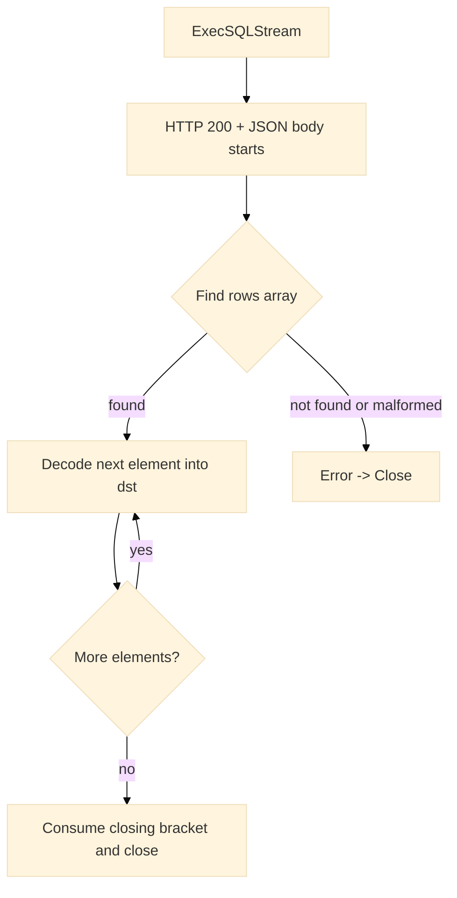

# Streaming & Pagination

Handling large result sets efficiently is critical for production workloads. The SDK provides two complementary strategies:

* **Streaming** (`ExecSQLStream` + `RowScanner`): decode rows incrementally from a SELECT response without loading the entire array into memory.
* **Pagination** (`Pager` over `BrowseRows`): retrieve fixed-size batches using limit/offset on the browse endpoint.

---

## When to use which

| Scenario                                                          | Recommended mechanism | Rationale                                                                      |
| ----------------------------------------------------------------- | --------------------- | ------------------------------------------------------------------------------ |
| Single, large `SELECT` result that should be processed row-by-row | **Streaming**         | Minimizes peak memory; sequential processing; back-pressure via consumer speed |
| UI-driven browsing or export where offsets are natural            | **Pagination**        | Deterministic pages; predictable batch sizes                                   |
| Small to moderate result sets                                     | Regular `ExecSQL`     | Simplicity; single allocation cost is acceptable                               |

---

## Method ↔ Endpoint mapping

| Concern               | SDK method                             | HTTP method & path                                                        | Headers (auto-applied when set)                                            |
| --------------------- | -------------------------------------- | ------------------------------------------------------------------------- | -------------------------------------------------------------------------- |
| Streaming SELECT      | `Client.ExecSQLStream`                 | `POST /warlotSql/projects/{project_id}/sql`                               | `Content-Type`, `User-Agent`, `x-api-key`, `x-holder-id`, `x-project-name` |
| Browse paginated rows | `Client.BrowseRows` / `Project.Browse` | `GET /warlotSql/projects/{project_id}/tables/{table}/rows?limit=&offset=` | `User-Agent`, `x-api-key`, `x-holder-id`, `x-project-name`                 |

---

## Streaming with `RowScanner`

### Sequence diagram



### Code example

```go
import (
	"context"
	"fmt"

	"github.com/steven3002/warlot-golang-sdk/warlot-go/warlot"
)

func streamProducts(ctx context.Context, cl *warlot.Client, projectID string) error {
	sc, err := cl.ExecSQLStream(ctx, projectID, warlot.SQLRequest{
		SQL: "SELECT id, name, price FROM products ORDER BY id",
	})
	if err != nil {
		return err
	}
	defer sc.Close()

	// Destination can be a map[string]any or a typed struct pointer.
	type Product struct {
		ID    int     `json:"id"`
		Name  string  `json:"name"`
		Price float64 `json:"price"`
	}

	var p Product
	for sc.Next(&p) {
		fmt.Printf("row: %+v\n", p)
	}
	return sc.Err() // returns nil when EOF reached cleanly
}
```

> Back-pressure occurs naturally: decoding proceeds as fast as the consumer iterates.

### Memory characteristics

* JSON tokens are consumed from the response stream.
* Peak memory proportional to a single row plus decoder buffers.
* Suitable for high-cardinality results or long-running exports.

---

## Pagination with `Pager`

### Code example

```go
import (
	"context"
	"fmt"

	"github.com/steven3002/warlot-golang-sdk/warlot-go/warlot"
)

func listRowsInPages(ctx context.Context, cl *warlot.Client, projectID, table string) error {
	p := warlot.Pager{
		Project: cl.Project(projectID),
		Table:   table,
		Limit:   250, // batch size
		Offset:  0,
	}
	for {
		rows, err := p.Next(ctx)
		if err != nil {
			return err
		}
		if rows == nil { // done
			break
		}
		for _, r := range rows {
			fmt.Println(r)
		}
	}
	return nil
}
```

### Browse response shape

```go
type BrowseRowsResponse struct {
	Limit  int                      `json:"limit"`
	Offset int                      `json:"offset"`
	Table  string                   `json:"table"`
	Rows   []map[string]interface{} `json:"rows"`
}
```

---

## API and Types (definitions)

### Streaming

```go
// Start a SELECT and return a RowScanner.
// Caller must Close() the scanner (or defer Close()).
func (c *Client) ExecSQLStream(ctx context.Context, projectID string, req SQLRequest, opts ...CallOption) (*RowScanner, error)

// Incremental JSON array reader for "rows" from ExecSQLStream.
type RowScanner struct {
	// internal fields omitted
}

// Next decodes the next row into dst (map or struct pointer).
// Returns false on EOF or error. Check Err() to distinguish.
func (s *RowScanner) Next(dst any) bool

// Err returns the terminal error (if any) after Next() returns false.
func (s *RowScanner) Err() error

// Close aborts/finishes the stream and releases resources.
func (s *RowScanner) Close() error
```

### Pagination

```go
// High-level pager that calls BrowseRows behind the scenes.
type Pager struct {
	Project Project
	Table   string
	Limit   int
	Offset  int
	Done    bool
}

// Next fetches the next page. Returns nil, nil when iteration is complete.
func (p *Pager) Next(ctx context.Context) ([]map[string]any, error)

// Browse endpoint accessors:
func (c *Client) BrowseRows(ctx context.Context, projectID, table string, limit, offset int, opts ...CallOption) (*BrowseRowsResponse, error)
func (p Project) Browse(ctx context.Context, table string, limit, offset int, opts ...CallOption) (*BrowseRowsResponse, error)
```

---

## Usage guidance

* **Streaming**

  * Prefer when the application processes rows sequentially (ETL pipelines, verification passes).
  * Ensure `Close()` is called to release the underlying HTTP body.
  * Use typed destinations for stronger guarantees (`struct` with JSON tags).

* **Pagination**

  * Prefer when offset/limit semantics are required (UIs, page-based exports).
  * Choose a batch size that balances server load and client memory (for example, 100–1000).
  * The `Pager` stops automatically when an empty page is returned.

---

## Error handling

* **Streaming:** `Next` returns `false` on EOF or error. Call `Err()` to distinguish clean termination from a decoding/transport error.
* **Pagination:** `Pager.Next` returns `(nil, nil)` when finished; any non-nil error should be handled immediately.
* **Transport/retry:** standard SDK retry and backoff rules apply to the initial streaming request and to each paginated call.

---

## Unit test definitions

### 1) Row streaming decodes multiple items

```go
// streaming_rowscanner_test.go (package warlot)
package warlot

import (
	"context"
	"net/http"
	"net/http/httptest"
	"testing"
)

func Test_RowScanner_StreamsRows(t *testing.T) {
	// Simulate a SELECT response with rows.
	body := `{"ok":true,"rows":[{"id":1,"name":"A"},{"id":2,"name":"B"},{"id":3,"name":"C"}]}`
	s := httptest.NewServer(http.HandlerFunc(func(w http.ResponseWriter, r *http.Request) {
		w.Header().Set("Content-Type", "application/json")
		w.WriteHeader(200)
		w.Write([]byte(body))
	}))
	defer s.Close()

	cl := New(WithBaseURL(s.URL))
	sc, err := cl.ExecSQLStream(context.Background(), "P", SQLRequest{SQL: "SELECT * FROM t", Params: nil})
	if err != nil {
		t.Fatalf("ExecSQLStream failed: %v", err)
	}
	defer sc.Close()

	type Row struct{ ID int `json:"id"`; Name string `json:"name"` }
	var got []Row
	var r Row
	for sc.Next(&r) {
		got = append(got, r)
	}
	if err := sc.Err(); err != nil {
		t.Fatalf("stream error: %v", err)
	}
	if len(got) != 3 || got[0].Name != "A" || got[2].ID != 3 {
		t.Fatalf("unexpected rows: %+v", got)
	}
}
```

### 2) Row streaming propagates decoding errors

```go
// streaming_rowscanner_error_test.go (package warlot)
package warlot

import (
	"context"
	"net/http"
	"net/http/httptest"
	"testing"
)

func Test_RowScanner_MalformedJSON_Error(t *testing.T) {
	// Missing closing bracket to trigger JSON error mid-stream.
	body := `{"ok":true,"rows":[{"id":1},{"id":2}`
	s := httptest.NewServer(http.HandlerFunc(func(w http.ResponseWriter, r *http.Request) {
		w.Header().Set("Content-Type", "application/json")
		w.WriteHeader(200)
		w.Write([]byte(body))
	}))
	defer s.Close()

	cl := New(WithBaseURL(s.URL))
	sc, err := cl.ExecSQLStream(context.Background(), "P", SQLRequest{SQL: "SELECT 1", Params: nil})
	if err != nil {
		t.Fatalf("ExecSQLStream failed: %v", err)
	}
	defer sc.Close()

	var m map[string]any
	for sc.Next(&m) {
		// iterate until error
	}
	if sc.Err() == nil {
		t.Fatalf("expected decoding error, got nil")
	}
}
```

### 3) Pager iterates until empty page

```go
// pagination_pager_test.go (package warlot)
package warlot

import (
	"context"
	"encoding/json"
	"net/http"
	"net/http/httptest"
	"testing"
)

func Test_Pager_PaginatesToEnd(t *testing.T) {
	// Serve two pages, then empty.
	type page struct {
		Limit  int                      `json:"limit"`
		Offset int                      `json:"offset"`
		Table  string                   `json:"table"`
		Rows   []map[string]interface{} `json:"rows"`
	}
	s := httptest.NewServer(http.HandlerFunc(func(w http.ResponseWriter, r *http.Request) {
		w.Header().Set("Content-Type", "application/json")
		q := r.URL.Query()
		offset := q.Get("offset")
		if offset == "0" || offset == "" {
			_ = json.NewEncoder(w).Encode(page{Limit: 2, Offset: 0, Table: "t",
				Rows: []map[string]interface{}{{"id": 1}, {"id": 2}},
			})
			return
		}
		if offset == "2" {
			_ = json.NewEncoder(w).Encode(page{Limit: 2, Offset: 2, Table: "t",
				Rows: []map[string]interface{}{{"id": 3}},
			})
			return
		}
		_ = json.NewEncoder(w).Encode(page{Limit: 2, Offset: 3, Table: "t", Rows: []map[string]interface{}{}})
	}))
	defer s.Close()

	cl := New(WithBaseURL(s.URL))
	p := Pager{Project: cl.Project("P"), Table: "t", Limit: 2}

	var total int
	for {
		rows, err := p.Next(context.Background())
		if err != nil {
			t.Fatalf("pager error: %v", err)
		}
		if rows == nil {
			break
		}
		total += len(rows)
	}
	if total != 3 {
		t.Fatalf("expected 3 rows total, got %d", total)
	}
}
```

---

## Troubleshooting

| Symptom                                      | Likely cause                                           | Action                                                               |
| -------------------------------------------- | ------------------------------------------------------ | -------------------------------------------------------------------- |
| `RowScanner.Next` never returns `true`       | Response missing `"rows"` array or non-SELECT response | Validate SQL; verify backend returns `{ "ok": true, "rows": [...] }` |
| `RowScanner.Err` returns JSON decoding error | Malformed upstream payload or early connection close   | Log response; retry; confirm server health                           |
| High latency during streaming                | Consumer performs slow per-row operations              | Buffer downstream work; increase parallelism where safe              |
| Pagination repeats rows                      | Concurrent writes modify table ordering                | Apply deterministic ordering or immutable snapshots where supported  |

---

## Related topics

* SQL execution model and request/response shapes: `06-sql.md`
* Error model and retries: `09-errors.md`, `10-retries-rate-limits.md`
* Table browsing and schema inspection: `tables` section in `06-sql.md` and `05-projects.md`
