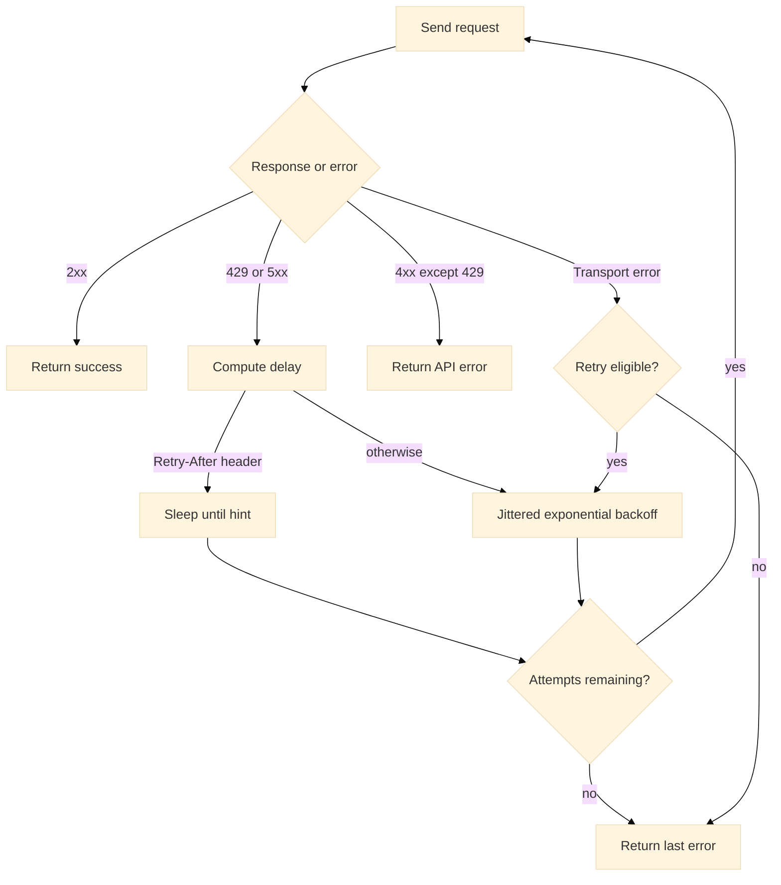

# Retries & Rate Limits

Reliable operation requires a clear policy for transient errors and rate limiting. The SDK implements jittered exponential backoff, honors `Retry-After`, forwards idempotency keys for safe write retries, and exposes configuration knobs for tuning.

---

## Policy overview

* **Automatic retries** for:

  * `429 Too Many Requests`
  * `5xx` Server Errors
  * Certain transport errors (e.g., temporary network failures), subject to context and client timeout.
* **No automatic retries** for:

  * `4xx` Client Errors other than `429` (e.g., `400`, `401`, `403`, `404`).
* **Delay calculation**:

  * If `Retry-After` is present, the delay respects that header (seconds or HTTP-date).
  * Otherwise, a **jittered exponential backoff** is used, bounded by configured minima and maxima.
* **Attempt count**:

  * Total attempts = `MaxRetries + 1`.
    Example: `MaxRetries = 3` → up to 4 total tries.
* **Idempotency**:

  * Write operations (INSERT/UPDATE/DELETE/DDL) should carry an idempotency key. The SDK forwards `x-idempotency-key` set by `WithIdempotencyKey`.

---

## Flow



---

## Configuration knobs

| Knob          | API                                       | Purpose                                                             | Default                          |
| ------------- | ----------------------------------------- | ------------------------------------------------------------------- | -------------------------------- |
| Max retries   | `WithRetries(int)`                        | Maximum retry count for 429/5xx and eligible transport errors       | `3`                              |
| Backoff range | `WithBackoff(initial, max time.Duration)` | Jittered exponential backoff, capped by `max`                       | `300ms` → `3s`                   |
| Timeout       | `WithHTTPClient(*http.Client)`            | Per-request deadline; also influenced by `context.Context`          | `30s` default in internal client |
| Logger        | `WithLogger(Logger)`                      | Structured logs around attempts and status codes (API key redacted) | disabled                         |

**Example:**

```go
client := warlot.New(
  warlot.WithRetries(6),
  warlot.WithBackoff(1*time.Second, 8*time.Second),
  warlot.WithHTTPClient(&http.Client{Timeout: 120 * time.Second}),
)
```

---

## Idempotency keys (writes)

* Header: `x-idempotency-key`.
* Purpose: ensure a write executes **at most once** from the server’s perspective even if the client retries.
* Recommendation: generate a stable, collision-resistant key per logical write (for example, ULID or namespaced string with timestamp and shard).

**Example:**

```go
proj := client.Project(projectID)
_, err := proj.SQL(ctx,
  `INSERT INTO orders (ext_id, amount) VALUES (?, ?)`,
  []any{"ext-123", 49.99},
  warlot.WithIdempotencyKey("orders/ext-123"),
)
```

---

## Observability

* Each attempt can be surfaced via the optional `Logger` hook:

  * `event = "request"` → method, URL, redacted headers, attempt index.
  * `event = "response"` → status code, URL, attempt index.
* `Retry-After` is parsed automatically; emitted delays are not logged by default but can be inferred from timestamps.

---

## Practical guidance

* **Short timeouts + small backoff** for interactive paths.
* **Longer timeouts + larger backoff** for batch ETL or migrations.
* **Concurrency control** helps remain within rate limits. A lightweight semaphore pattern is effective:

```go
sem := make(chan struct{}, 8) // allow up to 8 concurrent calls
call := func(ctx context.Context, sql string, params []any) error {
  select {
  case sem <- struct{}{}:
    defer func() { <-sem }()
  case <-ctx.Done():
    return ctx.Err()
  }
  _, err := proj.SQL(ctx, sql, params, warlot.WithIdempotencyKey("write-"+sql))
  return err
}
```

---

## Examples

### Retry on `429` honoring `Retry-After`

```go
client := warlot.New(
  warlot.WithRetries(5),
  warlot.WithBackoff(500*time.Millisecond, 10*time.Second),
)

_, err := client.ExecSQL(ctx, projectID, warlot.SQLRequest{
  SQL: "CREATE TABLE IF NOT EXISTS t(x INT)", Params: nil,
})
// If the server responded with 429 and Retry-After, the SDK delays accordingly and retries.
```

### Retry on `5xx` with jittered backoff

```go
client := warlot.New(warlot.WithRetries(4), warlot.WithBackoff(800*time.Millisecond, 6*time.Second))
res, err := client.ExecSQL(ctx, projectID, warlot.SQLRequest{SQL: "SELECT 1"})
```

### Stop immediately on non-retriable `4xx`

```go
_, err := client.ExecSQL(ctx, projectID, warlot.SQLRequest{SQL: "MALFORMED"})
// err is *warlot.APIError with StatusCode=400; no retries occur.
```

---

## Type definitions (relevant excerpts)

```go
// Construction-time
type Option func(*Client)
func WithRetries(max int) Option
func WithBackoff(initial, max time.Duration) Option
func WithHTTPClient(h *http.Client) Option
func WithLogger(l Logger) Option

// Per-call
type CallOption func(*callOptions)
func WithIdempotencyKey(k string) CallOption

// Error type on non-2xx
type APIError struct {
  StatusCode int
  Body       string
  Message    string
  Code       string
  Details    any
}
```

---

## Unit test definitions

### 1) `5xx` then success

```go
// retries_5xx_success_test.go (package warlot)
package warlot

import (
  "context"
  "net/http"
  "net/http/httptest"
  "sync/atomic"
  "testing"
)

func Test_Retry_5xx_ThenSuccess(t *testing.T) {
  var calls int32
  s := httptest.NewServer(http.HandlerFunc(func(w http.ResponseWriter, r *http.Request) {
    if atomic.AddInt32(&calls, 1) == 1 {
      http.Error(w, `{"message":"temporary"}`, http.StatusBadGateway)
      return
    }
    w.WriteHeader(200)
    w.Write([]byte(`{"ok":true,"row_count":0}`))
  }))
  defer s.Close()

  cl := New(WithBaseURL(s.URL), WithRetries(2))
  if _, err := cl.ExecSQL(context.Background(), "P", SQLRequest{SQL: "CREATE TABLE t(x)"}); err != nil {
    t.Fatalf("unexpected: %v", err)
  }
}
```

### 2) Honor `Retry-After` HTTP-date

```go
// retries_retryafter_httpdate_test.go (package warlot)
package warlot

import (
  "context"
  "net/http"
  "net/http/httptest"
  "testing"
  "time"
)

func Test_Retry_RetryAfter_HTTPDate(t *testing.T) {
  // Delay ~1s via HTTP-date header
  when := time.Now().Add(1 * time.Second).UTC().Format(http.TimeFormat)
  first := true
  s := httptest.NewServer(http.HandlerFunc(func(w http.ResponseWriter, r *http.Request) {
    if first {
      first = false
      w.Header().Set("Retry-After", when)
      http.Error(w, `{"message":"rate limit"}`, http.StatusTooManyRequests)
      return
    }
    w.WriteHeader(200)
    w.Write([]byte(`{"ok":true,"row_count":0}`))
  }))
  defer s.Close()

  cl := New(WithBaseURL(s.URL), WithRetries(2))
  start := time.Now()
  _, err := cl.ExecSQL(context.Background(), "P", SQLRequest{SQL: "CREATE TABLE t(x)"} )
  if err != nil {
    t.Fatalf("retry failed: %v", err)
  }
  if time.Since(start) < 900*time.Millisecond {
    t.Fatalf("Retry-After (HTTP-date) not honored")
  }
}
```

### 3) No retry on `400`

```go
// retries_no_retry_400_test.go (package warlot)
package warlot

import (
  "context"
  "net/http"
  "net/http/httptest"
  "testing"
)

func Test_NoRetry_On_400(t *testing.T) {
  s := httptest.NewServer(http.HandlerFunc(func(w http.ResponseWriter, r *http.Request) {
    http.Error(w, `{"message":"bad request"}`, http.StatusBadRequest)
  }))
  defer s.Close()

  cl := New(WithBaseURL(s.URL), WithRetries(5))
  _, err := cl.ExecSQL(context.Background(), "P", SQLRequest{SQL: "oops"})
  if err == nil {
    t.Fatalf("expected APIError on 400")
  }
  if e, ok := err.(*APIError); !ok || e.StatusCode != 400 {
    t.Fatalf("unexpected error: %#v", err)
  }
}
```

### 4) Idempotency key forwarded during retries

```go
// retries_idempotency_forward_test.go (package warlot)
package warlot

import (
  "context"
  "net/http"
  "net/http/httptest"
  "testing"
)

func Test_Idempotency_Header_Forwarded(t *testing.T) {
  seen := ""
  first := true
  s := httptest.NewServer(http.HandlerFunc(func(w http.ResponseWriter, r *http.Request) {
    if seen == "" {
      seen = r.Header.Get("x-idempotency-key")
    }
    if first {
      first = false
      http.Error(w, `{"message":"rate"}`, http.StatusTooManyRequests)
      return
    }
    w.WriteHeader(200)
    w.Write([]byte(`{"ok":true,"row_count":1}`))
  }))
  defer s.Close()

  cl := New(WithBaseURL(s.URL), WithRetries(1))
  _, err := cl.ExecSQL(context.Background(), "P",
    SQLRequest{SQL: "INSERT INTO t(x) VALUES (?)", Params: []any{1}},
    WithIdempotencyKey("k-1"),
  )
  if err != nil || seen != "k-1" {
    t.Fatalf("unexpected: idempotency=%q err=%v", seen, err)
  }
}
```

---

## Troubleshooting

| Symptom                         | Likely cause                                                   | Recommended action                                                            |
| ------------------------------- | -------------------------------------------------------------- | ----------------------------------------------------------------------------- |
| Frequent `429` despite retries  | Request rate exceeds server limits                             | Reduce concurrency, increase backoff maxima, apply idempotency keys on writes |
| Long delays between attempts    | Large `Retry-After` or high backoff ceiling                    | Lower `WithBackoff` maxima or reduce `WithRetries`                            |
| No retries on transient errors  | Status not in retryable set or context deadline too aggressive | Increase client/context timeouts; confirm `MaxRetries`                        |
| Duplicate inserts after retries | Missing idempotency key                                        | Provide stable `x-idempotency-key` for all writes                             |
| Context deadline exceeded       | Timeout shorter than combined backoff + server latency         | Increase `http.Client.Timeout` and/or context deadline                        |

---

## Related topics

* Error model and handling: `09-errors.md`
* SQL execution and idempotency usage: `06-sql.md`
* Streaming & pagination (large reads): `07-streaming-pagination.md`
