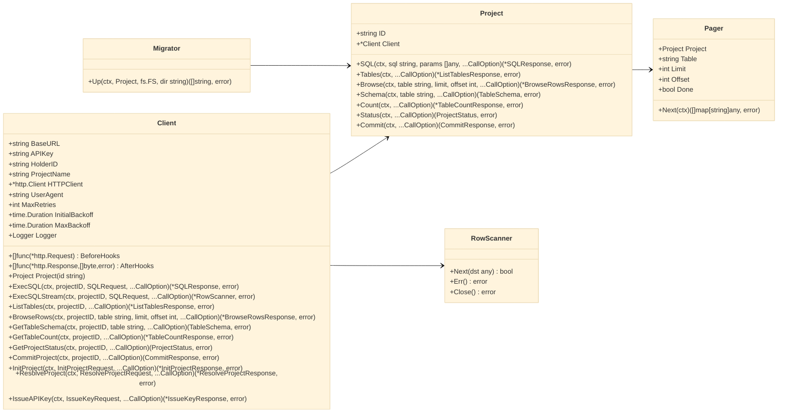

# Types Reference

A consolidated reference for public SDK types, method signatures, and JSON shapes used by the Warlot Go SDK. This page includes a high-level diagram, canonical type definitions, field semantics, and compact unit-test definitions.

---

## Overview diagram



---

## Core client and configuration

```go
// Construction
func New(opts ...Option) *Client
type Option func(*Client)

// Client carries base configuration and HTTP plumbing.
type Client struct {
	BaseURL        string
	APIKey         string        // forwarded as x-api-key
	HolderID       string        // forwarded as x-holder-id
	ProjectName    string        // forwarded as x-project-name
	HTTPClient     *http.Client
	UserAgent      string
	MaxRetries     int
	InitialBackoff time.Duration
	MaxBackoff     time.Duration
	Logger         Logger
	BeforeHooks    []func(*http.Request)
	AfterHooks     []func(*http.Response, []byte, error)
}

// Configuration options
func WithBaseURL(u string) Option
func WithAPIKey(k string) Option
func WithHolderID(h string) Option
func WithProjectName(n string) Option
func WithHTTPClient(h *http.Client) Option
func WithUserAgent(ua string) Option
func WithRetries(max int) Option
func WithBackoff(initial, max time.Duration) Option
func WithLogger(l Logger) Option

// Observability hook
type Logger func(event string, metadata map[string]any)
```

---

## Project handle

```go
// Lightweight wrapper bound to a project identifier.
type Project struct {
	ID     string
	Client *Client
}

func (c *Client) Project(id string) Project

// Thin wrappers around Client methods
func (p Project) SQL(ctx context.Context, sql string, params []any, opts ...CallOption) (*SQLResponse, error)
func (p Project) Tables(ctx context.Context, opts ...CallOption) (*ListTablesResponse, error)
func (p Project) Browse(ctx context.Context, table string, limit, offset int, opts ...CallOption) (*BrowseRowsResponse, error)
func (p Project) Schema(ctx context.Context, table string, opts ...CallOption) (TableSchema, error)
func (p Project) Count(ctx context.Context, opts ...CallOption) (*TableCountResponse, error)
func (p Project) Status(ctx context.Context, opts ...CallOption) (ProjectStatus, error)
func (p Project) Commit(ctx context.Context, opts ...CallOption) (CommitResponse, error)
```

---

## Per-call options

```go
type CallOption func(*callOptions)

func WithIdempotencyKey(k string) CallOption  // sets x-idempotency-key
func WithHeader(key, value string) CallOption // add a custom header
func WithLabel(l string) CallOption           // optional label propagated to hooks
```

---

## Project lifecycle (requests/responses)

```go
// Resolve
type ResolveProjectRequest struct {
	HolderID    string `json:"holder_id"`
	ProjectName string `json:"project_name"`
}
type ResolveProjectResponse struct {
	// Modern shape
	ExistsMeta  bool   `json:"exists_meta"`
	ExistsChain bool   `json:"exists_chain"`
	ProjectID   string `json:"project_id"`
	DBID        string `json:"db_id"`
	Action      string `json:"action"`
	// Legacy fields normalized if present
	LegacyProjectID string `json:"ProjectID,omitempty"`
	LegacyDBID      string `json:"DBID,omitempty"`
}

// Initialize
type InitProjectRequest struct {
	HolderID      string `json:"holder_id"`
	ProjectName   string `json:"project_name"`
	OwnerAddress  string `json:"owner_address"`
	EpochSet      int    `json:"epoch_set"`
	CycleEnd      int    `json:"cycle_end"`
	WritersLen    int    `json:"writers_len"`
	TrackBackLen  int    `json:"track_back_len"`
	DraftEpochDur int    `json:"draft_epoch_dur"`
	IncludePass   bool   `json:"include_pass"`
	Deletable     bool   `json:"deletable"`
}
type InitProjectResponse struct {
	ProjectID    string `json:"ProjectID"`
	DBID         string `json:"DBID"`
	WriterPassID string `json:"WriterPassID"`
	BlobID       string `json:"BlobID"`
	TxDigest     string `json:"TxDigest"`
	CSVHashHex   string `json:"CSVHashHex"`
	DigestHex    string `json:"DigestHex"`
	SignatureHex string `json:"SignatureHex"`
}

// Issue API key
type IssueKeyRequest struct {
	ProjectID     string `json:"projectId"`
	ProjectHolder string `json:"projectHolder"`
	ProjectName   string `json:"projectName"`
	User          string `json:"user"`
}
type IssueKeyResponse struct {
	APIKey string `json:"apiKey"`
	URL    string `json:"url"`
}

// Methods
func (c *Client) ResolveProject(ctx context.Context, req ResolveProjectRequest, opts ...CallOption) (*ResolveProjectResponse, error)
func (c *Client) InitProject(ctx context.Context, req InitProjectRequest, opts ...CallOption) (*InitProjectResponse, error)
func (c *Client) IssueAPIKey(ctx context.Context, req IssueKeyRequest, opts ...CallOption) (*IssueKeyResponse, error)
```

---

## SQL execution

```go
// Request / Response
type SQLRequest struct {
	SQL    string        `json:"sql"`
	Params []interface{} `json:"params"`
}
type SQLResponse struct {
	OK       bool                     `json:"ok"`
	RowCount *int                     `json:"row_count,omitempty"` // DDL/DML
	Rows     []map[string]interface{} `json:"rows,omitempty"`      // SELECT
	Error    string                   `json:"error,omitempty"`
}

// Methods
func (c *Client) ExecSQL(ctx context.Context, projectID string, req SQLRequest, opts ...CallOption) (*SQLResponse, error)
func (p Project) SQL(ctx context.Context, sql string, params []any, opts ...CallOption) (*SQLResponse, error)

// Typed mapping helper (SELECT only)
func Query[T any](ctx context.Context, p Project, sql string, params []any, opts ...CallOption) ([]T, error)
```

**Notes**

* Positional parameter placeholders use `?`.
* JSON numbers decode to `float64` in untyped maps by default; use `Query[T]` for typed mapping into Go structs.

---

## Tables, schema, status, commit

```go
// Tables list
type ListTablesResponse struct {
	Tables []string `json:"tables"`
}

// Browse rows (paginated)
type BrowseRowsResponse struct {
	Limit  int                      `json:"limit"`
	Offset int                      `json:"offset"`
	Table  string                   `json:"table"`
	Rows   []map[string]interface{} `json:"rows"`
}

// Table schema (gateway-defined)
type TableSchema = map[string]interface{}

// Status & commit (gateway-defined)
type ProjectStatus = map[string]interface{}
type CommitResponse = map[string]interface{}

// Count tables
type TableCountResponse struct {
	ProjectID  string `json:"project_id"`
	TableCount int    `json:"table_count"`
}

// Methods
func (c *Client) ListTables(ctx context.Context, projectID string, opts ...CallOption) (*ListTablesResponse, error)
func (c *Client) BrowseRows(ctx context.Context, projectID, table string, limit, offset int, opts ...CallOption) (*BrowseRowsResponse, error)
func (c *Client) GetTableSchema(ctx context.Context, projectID, table string, opts ...CallOption) (TableSchema, error)
func (c *Client) GetTableCount(ctx context.Context, projectID string, opts ...CallOption) (*TableCountResponse, error)
func (c *Client) GetProjectStatus(ctx context.Context, projectID string, opts ...CallOption) (ProjectStatus, error)
func (c *Client) CommitProject(ctx context.Context, projectID string, opts ...CallOption) (CommitResponse, error)

// Project convenience methods mirror the above (Tables, Browse, Schema, Count, Status, Commit)
```

---

## Streaming and pagination

```go
// Streaming SELECT reader
type RowScanner struct {
	// internal decoder and closer
}
func (s *RowScanner) Next(dst any) bool  // returns false on EOF or error
func (s *RowScanner) Err() error         // terminal error (nil on clean EOF)
func (s *RowScanner) Close() error       // release resources

func (c *Client) ExecSQLStream(ctx context.Context, projectID string, req SQLRequest, opts ...CallOption) (*RowScanner, error)

// Pagination helper over BrowseRows
type Pager struct {
	Project Project
	Table   string
	Limit   int
	Offset  int
	Done    bool
}
func (p *Pager) Next(ctx context.Context) ([]map[string]any, error) // returns (nil,nil) when complete
```

---

## Migrations

```go
// Stateless runner for file-based SQL migrations.
type Migrator struct{}

func (Migrator) Up(
	ctx context.Context,
	p Project,
	fsys fs.FS,
	dir string,
) (applied []string, err error)
```

**Ledger table**

| Column       | Type | Description             |
| ------------ | ---- | ----------------------- |
| `id`         | TEXT | Filename (PRIMARY KEY)  |
| `applied_at` | TEXT | RFC3339 timestamp (UTC) |

---

## Errors

```go
// Returned for non-2xx HTTP responses.
type APIError struct {
	StatusCode int
	Body       string
	Message    string
	Code       string
	Details    any
}
func (e *APIError) Error() string
```

**Behavior summary**

* Retries occur for `429` and `5xx`, honoring `Retry-After` when present.
* Non-retriable statuses (for example, `400/401/403/404`) are returned immediately.
* SQL runtime errors may appear as `200 OK` with `{ "ok": false, "error": "…" }`; the SDK returns an `error` in that case.

---

## JSON field tables (selected)

### IssueKeyRequest (camelCase)

| JSON field      | Go field        |
| --------------- | --------------- |
| `projectId`     | `ProjectID`     |
| `projectHolder` | `ProjectHolder` |
| `projectName`   | `ProjectName`   |
| `user`          | `User`          |

### ResolveProjectResponse (modern & legacy)

| JSON field   | Go field          | Notes                                          |
| ------------ | ----------------- | ---------------------------------------------- |
| `project_id` | `ProjectID`       | Primary modern field                           |
| `db_id`      | `DBID`            | Modern field                                   |
| `ProjectID`  | `LegacyProjectID` | Normalized into `ProjectID` if modern is empty |
| `DBID`       | `LegacyDBID`      | Normalized into `DBID` if modern is empty      |

---

## Unit-test definitions (types)

### 1) JSON tags for IssueKeyRequest (camelCase)

```go
// types_issuekey_json_test.go (package warlot)
package warlot

import (
	"encoding/json"
	"testing"
)

func Test_IssueKeyRequest_JSONTags(t *testing.T) {
	in := IssueKeyRequest{
		ProjectID: "P", ProjectHolder: "H", ProjectName: "N", User: "U",
	}
	b, err := json.Marshal(in)
	if err != nil {
		t.Fatal(err)
	}
	s := string(b)
	for _, want := range []string{`"projectId"`, `"projectHolder"`, `"projectName"`, `"user"`} {
		if !contains(s, want) {
			t.Fatalf("missing %s in JSON: %s", want, s)
		}
	}
}
func contains(s, sub string) bool { return len(s) >= len(sub) && (s == sub || (len(sub) > 0 && (len(s) > 0 && (contains(s[1:], sub) || s[:len(sub)] == sub)))) }
```

### 2) ResolveProjectResponse legacy normalization

```go
// types_resolve_legacy_test.go (package warlot)
package warlot

import (
	"context"
	"net/http"
	"net/http/httptest"
	"testing"
)

func Test_Resolve_NormalizesLegacy(t *testing.T) {
	s := httptest.NewServer(http.HandlerFunc(func(w http.ResponseWriter, r *http.Request) {
		w.Header().Set("Content-Type","application/json")
		w.Write([]byte(`{"ProjectID":"P-123","DBID":"DB-xyz"}`))
	}))
	defer s.Close()

	cl := New(WithBaseURL(s.URL))
	out, err := cl.ResolveProject(context.Background(), ResolveProjectRequest{HolderID:"H", ProjectName:"N"})
	if err != nil {
		t.Fatal(err)
	}
	if out.ProjectID != "P-123" || out.DBID != "DB-xyz" {
		t.Fatalf("normalization failed: %+v", out)
	}
}
```

### 3) TableCountResponse unmarshals integer field

```go
// types_tablecount_int_test.go (package warlot)
package warlot

import (
	"encoding/json"
	"testing"
)

func Test_TableCountResponse_Unmarshal(t *testing.T) {
	var out TableCountResponse
	if err := json.Unmarshal([]byte(`{"project_id":"P","table_count":3}`), &out); err != nil {
		t.Fatal(err)
	}
	if out.TableCount != 3 || out.ProjectID != "P" {
		t.Fatalf("unexpected: %+v", out)
	}
}
```

### 4) SQLResponse dual shape

```go
// types_sqlresponse_shapes_test.go (package warlot)
package warlot

import (
	"encoding/json"
	"testing"
)

func Test_SQLResponse_DDL_DML(t *testing.T) {
	var out SQLResponse
	if err := json.Unmarshal([]byte(`{"ok":true,"row_count":2}`), &out); err != nil {
		t.Fatal(err)
	}
	if !out.OK || out.RowCount == nil || *out.RowCount != 2 || out.Rows != nil {
		t.Fatalf("unexpected: %+v", out)
	}
}

func Test_SQLResponse_SELECT(t *testing.T) {
	var out SQLResponse
	if err := json.Unmarshal([]byte(`{"ok":true,"rows":[{"id":1}]}`), &out); err != nil {
		t.Fatal(err)
	}
	if !out.OK || out.RowCount != nil || len(out.Rows) != 1 {
		t.Fatalf("unexpected: %+v", out)
	}
}
```

### 5) APIError formatting

```go
// types_apierror_format_test.go (package warlot)
package warlot

import "testing"

func Test_APIError_ErrorMethod(t *testing.T) {
	e := &APIError{StatusCode: 403, Message: "forbidden", Code: "FORBIDDEN"}
	if got := e.Error(); got == "" || got == "forbidden" {
		t.Fatalf("unexpected Error(): %q", got)
	}
}
```

---

## Related topics

* Authentication, configuration, and headers: `03-authentication.md`, `04-configuration.md`
* SQL execution and mapping: `06-sql.md`
* Streaming & pagination: `07-streaming-pagination.md`
* Migrations: `08-migrations.md`
* Error semantics and retries: `09-errors.md`, `10-retries-rate-limits.md`
