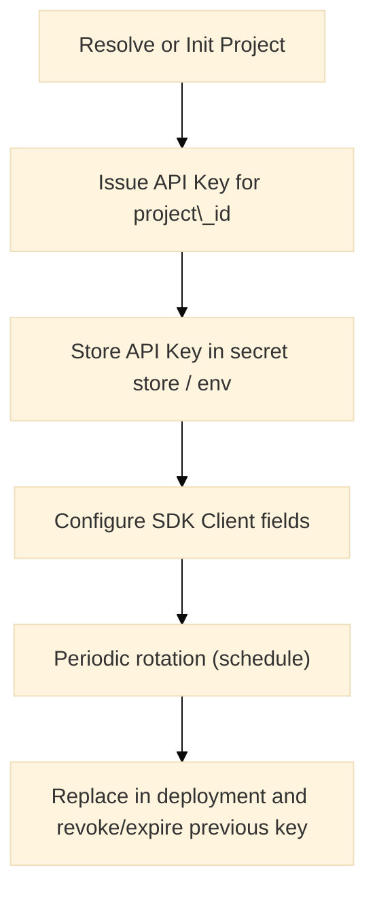

# Security

This section documents security-relevant behavior in the Warlot Go SDK and provides guidance for securely operating applications that integrate with the Warlot SQL Database API. Topics include transport, authentication, secret handling, logging & redaction, SQL injection mitigation, replay/idempotency, least-privilege scoping, rate limiting, and test patterns. Type and test definitions are included.

---

## Summary

* **Transport:** HTTPS is required; the SDK relies on Go’s standard TLS stack.
* **Authentication:** API keys are issued per project and forwarded via `x-api-key` alongside `x-holder-id` and `x-project-name`.
* **Secret handling:** The SDK never persists secrets; logs produced via the built-in logger redact `x-api-key`.
* **SQL injection mitigation:** Parameterized queries are supported (`params` array). String concatenation should be avoided in application code.
* **Replay safety:** Optional idempotency keys prevent duplicate effects when retries occur.
* **Isolation:** Each project is isolated; headers must match the intended project/holder scope.
* **Rate limits:** Automatic backoff on `429` and `5xx`. Excessive concurrency should be avoided.

---

## Threat model (concise)

| Risk                    | Vector                              | Mitigation in/with SDK                                                                                 |
| ----------------------- | ----------------------------------- | ------------------------------------------------------------------------------------------------------ |
| Secret exposure         | Logging, crash dumps, VCS           | Header redaction in logger; avoid printing API keys; store keys in secret stores; restrict CLI history |
| SQL injection           | Unsafe string interpolation         | Parameterized `SQLRequest.Params`; typed mapping via `Query[T]`                                        |
| Replay/duplicate writes | Retries after transient failures    | `WithIdempotencyKey` header on write operations                                                        |
| Lateral access          | Keys scoped to wrong project/holder | Ensure `HolderID` and `ProjectName` correspond to the issued key                                       |
| DoS / throttling        | High request rates                  | Automatic backoff; concurrency control; heed `Retry-After`                                             |
| Information leakage     | Over-detailed errors to end users   | Handle `APIError` carefully; avoid exposing raw `Body`                                                 |

---

## Transport security

* Communication occurs over HTTPS using Go’s default certificate verification against the system trust store.
* Custom transports (for corporate proxies or pinning experiments) can be supplied via `WithHTTPClient`. Certificate pinning is not enabled by default; if required, implement via a custom `http.Transport` with a restricted `TLSClientConfig.RootCAs` or `VerifyPeerCertificate` callback.

---

## Authentication & secret management

### Headers

| Header           | Source               | Purpose                                 |
| ---------------- | -------------------- | --------------------------------------- |
| `x-api-key`      | `Client.APIKey`      | Project-scoped secret for authorization |
| `x-holder-id`    | `Client.HolderID`    | Holder identity for request scoping     |
| `x-project-name` | `Client.ProjectName` | Human-readable project scope            |

**SDK behavior:** headers are auto-applied when fields are set on `Client`.

### Key lifecycle (flow)



**Operational guidance**

* Keys should be stored in a secure secret manager (for example, cloud KMS/Secrets Manager) or injected via environment variables on a per-deployment basis. Keys should never be committed to source control.
* Rotation should be scheduled. Replacement should be performed in rolling fashion, followed by revocation/expiry where supported by the backend.

---

## Logging and redaction

* The optional `Logger` hook receives request/response metadata. The SDK **redacts** `x-api-key` values before invoking the logger.
* Request/response hooks (`BeforeHooks`, `AfterHooks`) should avoid logging full bodies in production to reduce exposure risk.
* SQL statements and parameter values may be sensitive; avoid writing them to unprotected logs.

**Type excerpt**

```go
type Logger func(event string, metadata map[string]any)

// Construction example (redaction is automatic for x-api-key)
cl := warlot.New(
    warlot.WithLogger(func(evt string, m map[string]any) { /* ship to secure sink */ }),
)
```

---

## SQL injection mitigation

* The API accepts **parameterized** queries. Parameters are sent in a separate JSON array and bound server-side.
* String concatenation to construct SQL from untrusted input should be avoided.

**Safe pattern**

```go
_, err := proj.SQL(ctx,
    `INSERT INTO products (name, price) VALUES (?, ?)`,
    []any{"Laptop", 999.99},
)
```

**Unsafe pattern (do not emulate)**

```go
// risk: string interpolation of untrusted input
q := fmt.Sprintf(`INSERT INTO products (name) VALUES ("%s")`, rawName)
```

For typed reads, `Query[T]` maps rows into struct fields using JSON tags, reducing ad-hoc casting.

---

## Replay protection & idempotency

* For any write-like operation (INSERT/UPDATE/DELETE/DDL), set an idempotency key:

  * Header: `x-idempotency-key`
  * SDK: `WithIdempotencyKey("stable-key")`
* A deterministic identifier (for example, external primary key or ULID) is recommended.

**Example**

```go
_, err := proj.SQL(ctx,
  `INSERT INTO orders (ext_id, amount) VALUES (?, ?)`,
  []any{"ext-123", 49.99},
  warlot.WithIdempotencyKey("orders/ext-123"),
)
```

---

## Least privilege & project isolation

* Keys are project-scoped. `HolderID` and `ProjectName` supplied to the SDK must match the project for which the key was issued.
* Separate environments (dev/staging/prod) should use separate projects and keys.

---

## Rate limits & resource safety

* Automatic retries apply to `429` and `5xx`. `Retry-After` is honored. Excessive concurrency should be avoided to reduce throttling.
* For long-running selects, prefer streaming (`ExecSQLStream`) or pagination (`Pager`) to avoid excessive memory use and to maintain back-pressure.

---

## Error handling hygiene

* `APIError` includes a `Body` field with the raw response. This field is useful for diagnostics but should not be exposed directly to end users.
* Sensitive details can appear in upstream messages; sanitize when relaying.

**Type excerpt**

```go
type APIError struct {
    StatusCode int
    Body       string
    Message    string
    Code       string
    Details    any
}
```

---

## Secure configuration checklist

| Control          | Recommendation                                                             |
| ---------------- | -------------------------------------------------------------------------- |
| Secret storage   | Use a secret manager or environment variables injected at deploy time      |
| Logging          | Enable redaction (built-in) and avoid logging SQL and params in production |
| SQL construction | Use placeholders and `Params`; avoid string interpolation                  |
| Idempotency      | Provide a stable `x-idempotency-key` for all writes                        |
| Scope            | Ensure `HolderID` and `ProjectName` match the issued key’s project         |
| Concurrency      | Apply bounded concurrency and heed `Retry-After`                           |
| Timeouts         | Set reasonable `http.Client` and context deadlines; avoid infinite waits   |
| Dependencies     | Keep Go toolchain and dependencies updated; apply security patches         |

---

## Relevant SDK types (security-related)

```go
// Per-call options (idempotency & custom headers)
type CallOption func(*callOptions)
func WithIdempotencyKey(k string) CallOption
func WithHeader(key, value string) CallOption

// Logger hook (headers pre-redacted for x-api-key)
type Logger func(event string, metadata map[string]any)

// Client fields for auth headers (auto-forwarded when set)
type Client struct {
    APIKey      string // x-api-key
    HolderID    string // x-holder-id
    ProjectName string // x-project-name
}
```

---

## Unit test definitions

### 1) Logger redacts `x-api-key`

```go
// security_redaction_test.go (package warlot)
package warlot

import (
    "context"
    "net/http"
    "net/http/httptest"
    "strings"
    "sync/atomic"
    "testing"
)

func Test_Logger_RedactsAPIKey(t *testing.T) {
    s := httptest.NewServer(http.HandlerFunc(func(w http.ResponseWriter, r *http.Request) {
        w.Write([]byte(`{"ok":true,"row_count":0}`))
    }))
    defer s.Close()

    var seenMasked atomic.Value
    cl := New(
        WithBaseURL(s.URL),
        WithAPIKey("SECRET-KEY-123456"),
        WithLogger(func(evt string, m map[string]any) {
            if evt == "request" {
                if hdr, ok := m["headers"].(http.Header); ok {
                    seenMasked.Store(hdr.Get("x-api-key"))
                }
            }
        }),
    )
    _, err := cl.ExecSQL(context.Background(), "P", SQLRequest{SQL: "CREATE TABLE t(x)"} )
    if err != nil {
        t.Fatalf("unexpected: %v", err)
    }
    masked, _ := seenMasked.Load().(string)
    if masked == "" || (!strings.Contains(masked, "…") && masked != "********") {
        t.Fatalf("api key not redacted: %q", masked)
    }
}
```

### 2) Idempotency header forwarded

```go
// security_idempotency_header_test.go (package warlot)
package warlot

import (
    "context"
    "net/http"
    "net/http/httptest"
    "testing"
)

func Test_Idempotency_Forwarded(t *testing.T) {
    var got string
    s := httptest.NewServer(http.HandlerFunc(func(w http.ResponseWriter, r *http.Request) {
        got = r.Header.Get("x-idempotency-key")
        w.Write([]byte(`{"ok":true,"row_count":1}`))
    }))
    defer s.Close()

    cl := New(WithBaseURL(s.URL))
    _, err := cl.ExecSQL(context.Background(), "P",
        SQLRequest{SQL: "INSERT INTO t(x) VALUES (?)", Params: []any{1}},
        WithIdempotencyKey("k-secure-1"),
    )
    if err != nil || got != "k-secure-1" {
        t.Fatalf("unexpected: key=%q err=%v", got, err)
    }
}
```

### 3) Parameterized body prevents interpolation

```go
// security_params_shape_test.go (package warlot)
package warlot

import (
    "bytes"
    "context"
    "encoding/json"
    "io"
    "net/http"
    "net/http/httptest"
    "testing"
)

func Test_Params_SentAsArray(t *testing.T) {
    var body bytes.Buffer
    s := httptest.NewServer(http.HandlerFunc(func(w http.ResponseWriter, r *http.Request) {
        io.Copy(&body, r.Body)
        w.Write([]byte(`{"ok":true,"row_count":1}`))
    }))
    defer s.Close()

    cl := New(WithBaseURL(s.URL))
    _, err := cl.ExecSQL(context.Background(), "P",
        SQLRequest{SQL: "INSERT INTO t(name) VALUES (?)", Params: []any{`alice"`}},
    )
    if err != nil { t.Fatal(err) }

    var payload map[string]any
    if err := json.Unmarshal(body.Bytes(), &payload); err != nil {
        t.Fatal(err)
    }
    if _, ok := payload["params"].([]any); !ok {
        t.Fatalf("params not sent as array: %v", payload["params"])
    }
}
```

### 4) API error body not exposed inadvertently

```go
// security_apierror_not_exposed_test.go (package warlot)
package warlot

import (
    "context"
    "net/http"
    "net/http/httptest"
    "testing"
)

func Test_APIError_Structured_Only(t *testing.T) {
    s := httptest.NewServer(http.HandlerFunc(func(w http.ResponseWriter, r *http.Request) {
        http.Error(w, `{"message":"forbidden","details":{"hint":"omit public exposure"}}`, http.StatusForbidden)
    }))
    defer s.Close()

    cl := New(WithBaseURL(s.URL))
    _, err := cl.ExecSQL(context.Background(), "P", SQLRequest{SQL: "SELECT 1"})
    if err == nil {
        t.Fatalf("expected APIError")
    }
    if e, ok := err.(*APIError); !ok || e.StatusCode != 403 || e.Message == "" {
        t.Fatalf("unexpected error: %#v", err)
    }
}
```

---

## Additional operational guidance

* **Environment separation:** distinct keys and projects for development, staging, and production environments.
* **CLI hygiene:** environment variables should be set in a session-scoped manner; shells may record command history containing parameters—sensitive values should be avoided in raw command invocations.
* **Memory hygiene:** large result sets should be processed via streaming to reduce memory retention; sensitive fields in row data should be handled with care and zeroed where appropriate after use.

---

## Related documentation

* Authentication: `03-authentication.md`
* Configuration: `04-configuration.md`
* SQL and parameterization: `06-sql.md`
* Streaming & pagination: `07-streaming-pagination.md`
* Migrations: `08-migrations.md`
* Errors and retries: `09-errors.md`, `10-retries-rate-limits.md`
