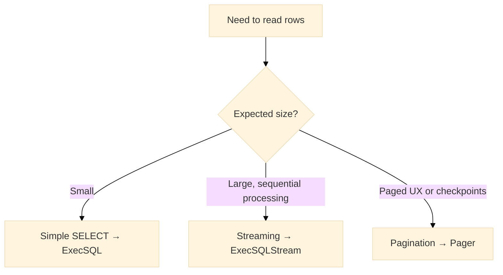

# FAQ

Concise answers to frequently asked questions regarding the Warlot Go SDK, organized by topic. Links to deeper sections are included at the end.

---

## Installation & setup

### How is the SDK added to a project?

```bash
go get github.com/steven3002/warlot-golang-sdk/warlot-go@v1
go mod tidy
```

Minimum recommended Go version: **1.21+**.

### How are pre-release or specific versions pinned?

```bash
# exact version
go get github.com/steven3002/warlot-golang-sdk/warlot-go@v1.0.0
# allow patch updates within 1.0
go get github.com/steven3002/warlot-golang-sdk/warlot-go@v1.0
```

### How is a custom API base URL configured?

```go
cl := warlot.New(
  warlot.WithBaseURL("https://warlot-api.onrender.com"), // or self-hosted URL
)
```

---

## Authentication & headers

### Which headers are required for database calls?

* `x-api-key` – project-scoped API key
* `x-holder-id` – holder identifier
* `x-project-name` – project name

They can be set once on the client:

```go
cl := warlot.New(
  warlot.WithAPIKey("…"),
  warlot.WithHolderID("0x…"),
  warlot.WithProjectName("project_alpha"),
)
```

### How is an API key issued?

1. Initialize or resolve the project to obtain `project_id`.
2. Call `IssueAPIKey`:

```go
res, _ := cl.IssueAPIKey(ctx, warlot.IssueKeyRequest{
  ProjectID: "project_id",
  ProjectHolder: "0x…",
  ProjectName: "project_alpha",
  User: "0xowner…",
})
_ = res.APIKey // store in a secret manager and set via WithAPIKey
```

---

## Projects (resolve/init)

### Why does resolve return legacy fields (`ProjectID`, `DBID`)?

The service may emit legacy field names. The SDK normalizes to modern fields:

```go
out, _ := cl.ResolveProject(ctx, warlot.ResolveProjectRequest{HolderID:"0x…", ProjectName:"…" })
// out.ProjectID / out.DBID populated from modern or legacy fields
```

### When should `InitProject` be called?

If `ResolveProject` indicates absence, call `InitProject` to create a new project and then issue an API key.

---

## SQL execution

### How are parameters passed safely?

```go
_, err := proj.SQL(ctx,
  `INSERT INTO products (name, price) VALUES (?, ?)`,
  []any{"Laptop", 999.99},
)
```

### Why do numeric values appear as `float64` in maps?

Untyped JSON decoding uses `float64` for numbers. Use typed mapping:

```go
type Product struct {
  ID int `json:"id"`
  Name string `json:"name"`
  Price float64 `json:"price"`
}
rows, _ := warlot.Query[Product](ctx, proj, `SELECT id,name,price FROM products`, nil)
```

### How are large result sets handled?

Use streaming or pagination.

```go
// streaming
sc, _ := cl.ExecSQLStream(ctx, projectID, warlot.SQLRequest{SQL: "SELECT * FROM big"})
defer sc.Close()
var row map[string]any
for sc.Next(&row) { /* process */ }
if err := sc.Err(); err != nil { /* handle */ }

// pagination
pg := &warlot.Pager{Project: proj, Table: "big", Limit: 100}
for {
  batch, err := pg.Next(ctx)
  if err != nil || len(batch) == 0 { break }
}
```

---

## Retries, rate limits, and idempotency

### Are requests retried automatically?

Yes, `429` and `5xx` responses are retried with jittered exponential backoff. `Retry-After` is honored when present. Configure bounds:

```go
cl := warlot.New(
  warlot.WithRetries(5),
  warlot.WithBackoff(500*time.Millisecond, 8*time.Second),
)
```

### How are duplicate writes prevented during retries?

Provide an idempotency key for write operations:

```go
_, _ = proj.SQL(ctx,
  `INSERT INTO orders (ext_id, amount) VALUES (?, ?)`,
  []any{"ext-123", 49.99},
  warlot.WithIdempotencyKey("orders/ext-123"),
)
```

---

## Errors & diagnostics

### What does `context deadline exceeded` indicate?

A timeout expired before completion. Increase the per-request deadline or the HTTP client timeout:

```go
ctx, cancel := context.WithTimeout(context.Background(), 60*time.Second)
defer cancel()
```

### Why is `APIError` returned on 4xx/5xx?

Non-2xx statuses return `*warlot.APIError` with parsed `Message`, optional `Code`, and raw `Body` for diagnostics. Example handling:

```go
res, err := proj.SQL(ctx, `SELECT 1`, nil)
if err != nil {
  if e, ok := err.(*warlot.APIError); ok && e.StatusCode == 401 {
    // refresh key or scope
  }
}
```

### How can request/response attempts be logged safely?

Attach a logger; the SDK redacts `x-api-key`:

```go
cl := warlot.New(warlot.WithLogger(func(evt string, m map[string]any) {
  // ship to a secure sink; api key already redacted
}))
```

---

## CLI

### How is the CLI built and used?

```bash
go build -o warlotctl ./warlot-go/cmd/warlotctl
./warlotctl -h
```

Common sequence:

```bash
./warlotctl resolve -holder "$WARLOT_HOLDER" -pname "$WARLOT_PNAME"
./warlotctl init -holder "$WARLOT_HOLDER" -pname "$WARLOT_PNAME" -owner "$WARLOT_OWNER"
./warlotctl issue-key -project "$P" -holder "$WARLOT_HOLDER" -pname "$WARLOT_PNAME" -user "$WARLOT_OWNER"
./warlotctl sql -project "$P" -q 'SELECT 1'
```

### Why do CLI JSON params sometimes fail on Windows shells?

Quoting rules differ. Prefer a params file or escaped JSON:

```powershell
.\warlotctl sql -project $env:P -q "INSERT INTO t(x) VALUES (?)" -params "[1]"
```

---

## Testing

### How are unit tests executed?

```bash
go test ./warlot -v
go test ./warlot -v -race
```

### How is the live end-to-end test enabled?

```bash
export WARLOT_E2E=1
export WARLOT_HOLDER=0x…
export WARLOT_OWNER=0x…
export WARLOT_PNAME=…
go test ./warlot -v -run TestE2E_Live -count=1
```

---

## Decision aid: read strategy



---

## Security

### Does the SDK store API keys?

No. Keys are held in process memory only. Redaction is applied in logger output. Keys should be injected via a secret store or environment variables and never committed to source control.

### Is SQL sanitized automatically?

Sanitization is not performed. The API supports parameterized queries; parameters should be used to mitigate injection risk.

---

## Versioning

### What is the versioning policy?

The SDK follows Semantic Versioning. Breaking changes only occur in MAJOR releases. See the changelog for details and migration notes.

---

## Compact test definitions (selected)

### Retry then success (5xx)

```go
func TestFAQ_Retry5xx(t *testing.T) {
  var first int32
  s := httptest.NewServer(http.HandlerFunc(func(w http.ResponseWriter, r *http.Request) {
    if atomic.AddInt32(&first, 1) == 1 {
      http.Error(w, `{"message":"temporary"}`, http.StatusBadGateway); return
    }
    w.Write([]byte(`{"ok":true,"row_count":0}`))
  }))
  defer s.Close()
  cl := warlot.New(warlot.WithBaseURL(s.URL), warlot.WithRetries(1))
  if _, err := cl.ExecSQL(context.Background(), "P", warlot.SQLRequest{SQL:"CREATE TABLE t(x)"}); err != nil {
    t.Fatal(err)
  }
}
```

### Typed mapping of SELECT

```go
func TestFAQ_QueryTyped(t *testing.T) {
  s := httptest.NewServer(http.HandlerFunc(func(w http.ResponseWriter, r *http.Request) {
    w.Write([]byte(`{"ok":true,"rows":[{"id":1,"name":"A","price":2.5}]}`))
  }))
  defer s.Close()
  cl := warlot.New(warlot.WithBaseURL(s.URL))
  p := cl.Project("P")
  type Row struct{ ID int `json:"id"`; Name string `json:"name"`; Price float64 `json:"price"` }
  got, err := warlot.Query[Row](context.Background(), p, "SELECT ...", nil)
  if err != nil || len(got) != 1 { t.Fatalf("unexpected: %v %#v", err, got) }
}
```

---

## Related documentation

* Installation: `01-installation.md`
* Quickstart: `02-quickstart.md`
* Authentication: `03-authentication.md`
* Configuration & retries: `04-configuration.md`, `10-retries-rate-limits.md`
* SQL: `06-sql.md`
* Streaming & pagination: `07-streaming-pagination.md`
* Migrations: `08-migrations.md`
* Errors: `09-errors.md`
* CLI: `11-cli.md`
* Types: `12-types.md`
* Testing: `13-testing.md`
* Security: `15-security.md`
* Versioning & changelog: `16-versioning-changelog.md`
