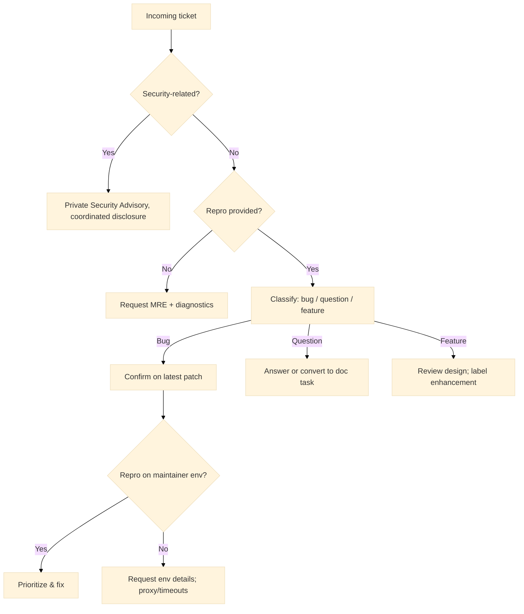

# Support

Centralized guidance for obtaining assistance with the Warlot Go SDK. This page details support channels, pre-submission checks, required diagnostics, issue templates, triage flow, and privacy expectations. It also includes compact diagnostic snippets and optional tests that help produce actionable reports.

---

## Support channels

| Channel                | Purpose                                       | Link                                                               |
| ---------------------- | --------------------------------------------- | ------------------------------------------------------------------ |
| **GitHub Issues**      | Bug reports, regressions, feature requests    | `github.com/steven3002/warlot-golang-sdk/warlot-go/issues`         |
| **GitHub Discussions** | Usage questions, patterns, design feedback    | `github.com/steven3002/warlot-golang-sdk/warlot-go/discussions`    |
| **Security (private)** | Vulnerability reports, coordinated disclosure | GitHub **Security Advisories** for the repository (private report) |
| **Operational status** | Quick API reachability check                  | Run the “Connectivity preflight” below                             |

> Sensitive credentials must not be shared in public channels. Redaction guidance appears in **Privacy & redaction**.

---

## Before opening an issue

* Reproduce on the **latest patch** of the targeted **minor** version (see Versioning policy).
* Run the **Connectivity preflight** to separate SDK issues from network problems.
* Collect a **Minimal Reproducible Example (MRE)** containing fewer than ~50 lines if possible.
* Enable the SDK **logger** (with redaction) to capture request/response metadata.
* For rate limiting or transient failures, confirm behavior with retries enabled.

---

## Connectivity preflight

These steps help isolate environmental problems:

```bash
# 1) Go toolchain & module info
go version
go env GOPATH GOOS GOARCH
go list -m github.com/steven3002/warlot-golang-sdk/warlot-go

# 2) Network reachability (exit code should be 0)
curl -sS -I https://warlot-api.onrender.com || echo "unreachable"
```

Minimal Go snippet to validate client construction and a simple call:

```go
package main

import (
  "context"
  "fmt"
  "time"

  "github.com/steven3002/warlot-golang-sdk/warlot-go/warlot"
)

func main() {
  ctx, cancel := context.WithTimeout(context.Background(), 30*time.Second)
  defer cancel()

  cl := warlot.New(
    warlot.WithAPIKey("<redacted>"),
    warlot.WithHolderID("<holder>"),
    warlot.WithProjectName("<project_name>"),
  )

  // Non-destructive: resolve project
  _, err := cl.ResolveProject(ctx, warlot.ResolveProjectRequest{
    HolderID: "<holder>", ProjectName: "<project_name>",
  })
  fmt.Printf("resolve err=%v\n", err)
}
```

---

## Information to include

| Category                | Details                                                                                                            |
| ----------------------- | ------------------------------------------------------------------------------------------------------------------ |
| **Environment**         | SDK version (`warlot.Version`), Go version, OS/architecture, container/WSL if applicable                           |
| **Configuration**       | Base URL, HTTP timeouts, retry settings, proxy variables (`HTTP_PROXY`, `HTTPS_PROXY`, `NO_PROXY`)                 |
| **Project scope**       | `holder_id`, `project_name` (non-sensitive), whether the project was newly initialized                             |
| **Operation**           | Endpoint/method used (for example, `POST /warlotSql/projects/{id}/sql`), SQL statement class (DDL/DML/SELECT)      |
| **Reproduction**        | Minimal code snippet or CLI commands; include parameter values that are non-sensitive or synthetic                 |
| **Diagnostics**         | Logger output (with redaction), status codes, `Retry-After` values, timestamps (UTC), correlation IDs if available |
| **Expected vs. actual** | One sentence each, precise and verifiable                                                                          |
| **Frequency**           | Always, intermittent, or first occurrence after upgrade                                                            |

---

## Issue templates

### Bug report (Markdown)

````markdown
### Summary
<one-sentence statement of the malfunction>

### Environment
- SDK: <warlot.Version> / API: <warlot.APIVersion>
- Go: <go version>
- OS/Arch: <e.g., linux/amd64>
- Base URL: <e.g., https://warlot-api.onrender.com>
- Proxy: <none|http://…|N/A>

### Configuration
- Timeout: <e.g., 30s>
- Retries / Backoff: <e.g., 3 / 300ms..3s>
- Idempotency: <set|not set>

### Reproduction
```go
<minimal snippet or CLI steps>
````

### Observed

<actual result, include status codes and excerpts>

### Expected

<desired behavior>

### Diagnostics

* Status: <e.g., 429 w/ Retry-After: 2s>
* Logger excerpt (API key redacted):

```
<lines>
```

* Timestamp (UTC): <2025-10-03T01:23:45Z>

````

### Feature request (Markdown)

```markdown
### Use case
<problem statement and context>

### Proposal
<shape of SDK surface or behavior>

### Alternatives considered
<brief notes>

### Impact
<users or flows affected; performance/migration notes if any>
````

### Documentation issue (Markdown)

```markdown
### Location
<page/section/file>

### Problem
<unclear/missing/incorrect information>

### Suggested fix
<concrete replacement/addition>
```

---

## Privacy & redaction

* API keys must never be posted in clear text.
* The SDK logger redacts `x-api-key` automatically; additional sensitive fields in payloads should be removed before sharing.
* SQL and parameters may contain PII; consider masking or replacing with synthetic values.

**Type excerpt**

```go
type Logger func(event string, metadata map[string]any)
// The SDK redacts x-api-key before invoking Logger.
```

---

## Triage & escalation flow



---

## Support policy (non-binding)

| Area                 | Guidance                                                                         |
| -------------------- | -------------------------------------------------------------------------------- |
| **Version support**  | Latest minor on the latest two major lines receive fixes (see Versioning policy) |
| **Response targets** | Community best-effort via GitHub; response times vary                            |
| **Breaking changes** | Only in MAJOR releases; migration notes are provided in the changelog            |
| **Security**         | Private reporting through GitHub Security Advisories is preferred                |

---

## Optional diagnostics: logger & hooks

```go
cl := warlot.New(
  warlot.WithLogger(func(evt string, meta map[string]any) {
    // Ship to a secure sink; API key already redacted.
    // Recommended: include timestamp and a correlation ID.
    _ = evt; _ = meta
  }),
)
cl.BeforeHooks = append(cl.BeforeHooks, func(r *http.Request) {
  r.Header.Set("X-Correlation-ID", "diag-"+time.Now().UTC().Format(time.RFC3339Nano))
})
```

---

## Sample MRE (SQL path)

```go
type Product struct {
  ID    int     `json:"id"`
  Name  string  `json:"name"`
  Price float64 `json:"price"`
}

func sample(ctx context.Context, cl *warlot.Client, projectID string) error {
  p := cl.Project(projectID)

  // DDL
  if _, err := p.SQL(ctx, `CREATE TABLE IF NOT EXISTS products (id INTEGER PRIMARY KEY, name TEXT, price REAL)`, nil); err != nil {
    return err
  }
  // DML (with idempotency)
  if _, err := p.SQL(ctx, `INSERT INTO products (id,name,price) VALUES (?,?,?)`,
    []any{1, "A", 2.5}, warlot.WithIdempotencyKey("prod-1")); err != nil {
    return err
  }
  // SELECT (typed)
  rows, err := warlot.Query[Product](ctx, p, `SELECT id,name,price FROM products`, nil)
  if err != nil { return err }
  _ = rows
  return nil
}
```

---

## Compact tests for support diagnostics (optional)

### 1) Logger redaction persists in reports

```go
func TestSupport_LoggerRedaction(t *testing.T) {
  s := httptest.NewServer(http.HandlerFunc(func(w http.ResponseWriter, r *http.Request) {
    w.Write([]byte(`{"ok":true,"row_count":0}`))
  }))
  defer s.Close()

  var seen string
  cl := warlot.New(
    warlot.WithBaseURL(s.URL),
    warlot.WithAPIKey("SENSITIVE-KEY-123456"),
    warlot.WithLogger(func(evt string, m map[string]any) {
      if evt == "request" {
        if h, ok := m["headers"].(http.Header); ok {
          seen = h.Get("x-api-key")
        }
      }
    }),
  )
  _, err := cl.ExecSQL(context.Background(), "P", warlot.SQLRequest{SQL: "CREATE TABLE t(x)"})
  if err != nil { t.Fatal(err) }
  if strings.Contains(seen, "SENSITIVE-KEY") {
    t.Fatalf("API key not redacted in logger: %q", seen)
  }
}
```

### 2) Retry-After visible in diagnostics

```go
func TestSupport_RetryAfterLogged(t *testing.T) {
  when := time.Now().Add(1*time.Second).UTC().Format(http.TimeFormat)
  s := httptest.NewServer(http.HandlerFunc(func(w http.ResponseWriter, r *http.Request) {
    w.Header().Set("Retry-After", when)
    http.Error(w, `{"message":"rate"}`, http.StatusTooManyRequests)
  }))
  defer s.Close()

  var sawRetryAfter bool
  cl := warlot.New(
    warlot.WithBaseURL(s.URL),
    warlot.WithRetries(1),
    warlot.WithLogger(func(evt string, m map[string]any) {
      if evt == "response" {
        if st, _ := m["status"].(int); st == 429 { sawRetryAfter = true }
      }
    }),
  )
  _, _ = cl.ExecSQL(context.Background(), "P", warlot.SQLRequest{SQL: "CREATE TABLE t(x)"})
  if !sawRetryAfter { t.Fatalf("Retry-After not observed in diagnostics") }
}
```

---

## Responsible disclosure

* Vulnerabilities and suspected security issues should be reported privately via **GitHub Security Advisories** for the repository.
* Public issues should not contain exploit details or secrets.
* Acknowledgements are added to release notes when appropriate.

---

## Related documentation

* Troubleshooting: `14-troubleshooting.md`
* Security: `15-security.md`
* Versioning & changelog: `16-versioning-changelog.md`
* Testing: `13-testing.md`
* CLI usage: `11-cli.md`
